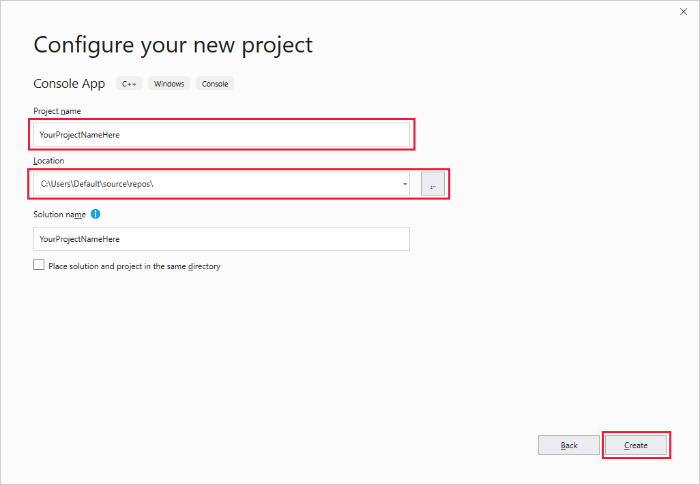

To create a Visual Studio project for C++ desktop development, you need to set up Visual Studio development options, create the project, select the target architecture, and install the Speech SDK.

### Set up Visual Studio development options

To start, make sure you're set up correctly in Visual Studio for C++ desktop development:

1. Open Visual Studio 2019 to display the **Start** window.

   

1. Select **Continue without code** to go to the Visual Studio IDE.

1. From the Visual Studio menu bar, select **Tools** > **Get Tools and Features** to open Visual Studio Installer and view the **Modifying** dialog box.

   

1. In the **Workloads** tab, under **Windows**, find the **Desktop development with C++** workload. If the check box next to that workload isn't already selected, select it.

1. In the **Individual components** tab, find the **Nuget package manager** check box. If the check box isn't already selected, select it.

1. Select the button in the corner labeled either **Close** or **Modify**. (The button name varies depending on whether you selected any features for installation.) If you select **Modify**, installation begins, which may take a while.

1. Close Visual Studio Installer.

### Create the project and select the target architecture

Next, create your project:

1. In the Visual Studio menu bar, choose **File** > **New** > **Project** to display the **Create a new project** window.

   

1. Find and select **Console App**. Make sure that you select the C++ version of this project type (as opposed to C# or Visual Basic).

1. Select **Next** to display the **Configure your new project** screen.

   

1. In **Project name**, enter `helloworld`.

1. In **Location**, navigate to and select or create the folder to save your project in.

Now select your target platform architecture. In the Visual Studio toolbar, find the **Solution Platforms** drop-down box. (If you don't see it, choose **View** > **Toolbars** > **Standard** to display the toolbar containing **Solution Platforms**.) If you're running 64-bit Windows, choose **x64** in the drop-down box. 64-bit Windows can also run 32-bit applications, so you can choose **x86** if you prefer.

### Install the Speech SDK

Finally, install the [Speech SDK NuGet package](https://aka.ms/csspeech/nuget), and reference the Speech SDK in your project:

1. In **Solution Explorer**, right-click your solution, and choose **Manage NuGet Packages for Solution** to go to the **Nuget - Solution** window.

1. Select **Browse**.

   

1. In **Package source**, choose **nuget.org**.

1. In the **Search** box, enter `Microsoft.CognitiveServices.Speech`, and then choose that package after it appears in the search results.

   

1. In the package status pane next to the search results, select your **helloworld** project.

1. Select **Install**.

1. In the **Preview Changes** dialog box, select **OK**.

1. In the **License Acceptance** dialog box, view the license, and then select **I Accept**. The package installation begins, and when installation is complete, the **Output** pane displays a message similar to the following text: `Successfully installed 'Microsoft.CognitiveServices.Speech 1.12.1' to helloworld`.
