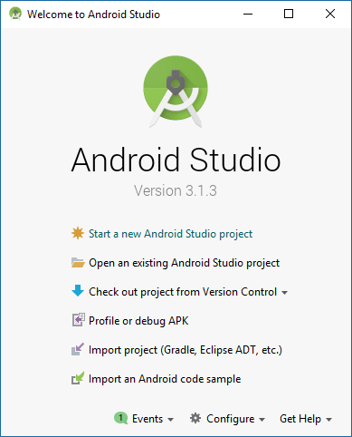
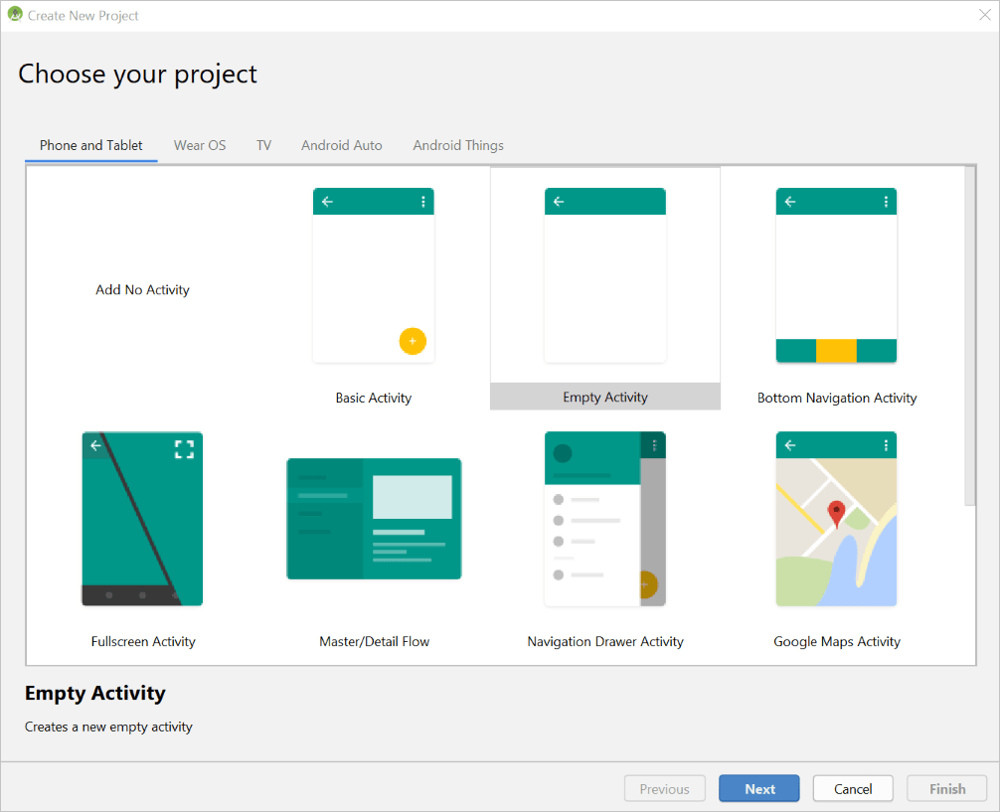
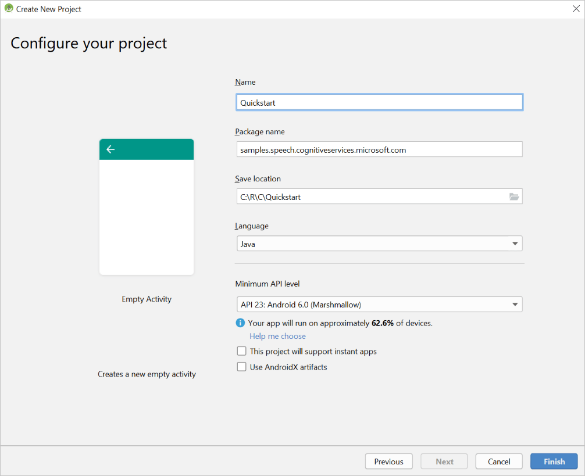
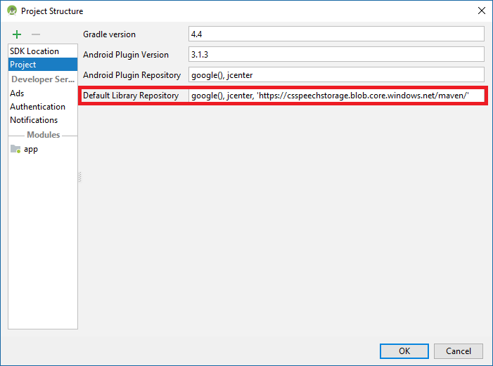
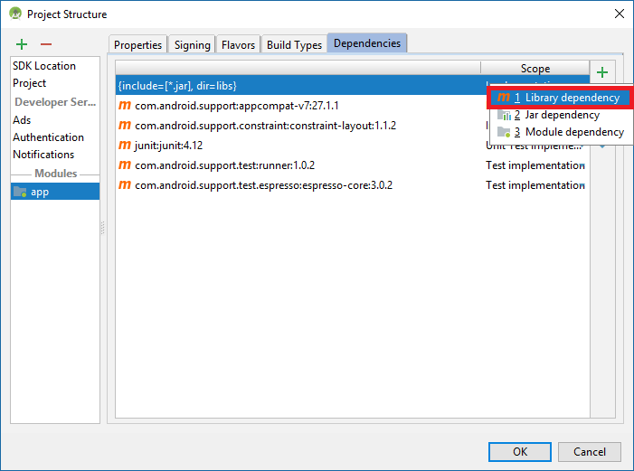
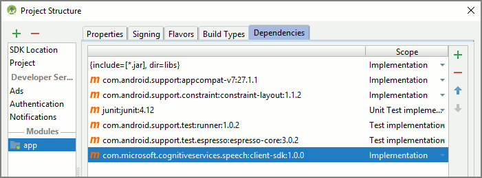
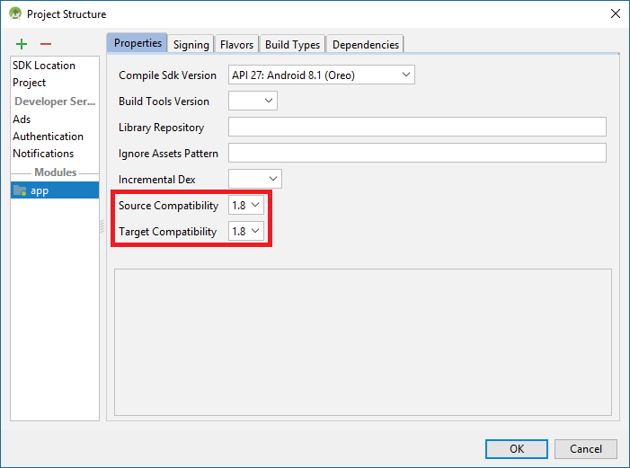

1. Launch Android Studio, and select **Start a new Android Studio project** in the **Welcome** window.

    

1. The **Choose your project** wizard appears. Select **Phone and Tablet** and **Empty Activity** in the activity selection box. Select **Next**.

   

1. On the **Configure your project** screen, enter *Quickstart* as **Name** and enter *samples.speech.cognitiveservices.microsoft.com* as **Package name**. Then select a project directory. For **Minimum API level**, select **API 23: Android 6.0 (Marshmallow)**. Leave all other check boxes clear, and select **Finish**.

   

Android Studio takes a moment to prepare your new Android project. Next, configure the project to know about the Azure Cognitive Services Speech SDK and to use Java 8.

[!INCLUDE [License notice](cognitive-services-speech-service-license-notice.md)]

The current version of the Cognitive Services Speech SDK is 1.12.1.

The Speech SDK for Android is packaged as an [AAR (Android Library)](https://developer.android.com/studio/projects/android-library), which includes the necessary libraries and required Android permissions.
It's hosted in a Maven repository at https:\//csspeechstorage.blob.core.windows.net/maven/.

Set up your project to use the Speech SDK. Open the **Project Structure** window by selecting **File** > **Project Structure** from the Android Studio menu bar. In the **Project Structure** window, make the following changes:

1. In the list on the left side of the window, select **Project**. Edit the **Default Library Repository** settings by appending a comma and our Maven repository URL enclosed in single quotation marks: 'https:\//csspeechstorage.blob.core.windows.net/maven/'

   

1. On the same screen, on the left side, select **app**. Then select the **Dependencies** tab at the top of the window. Select the green plus sign (**+**), and select **Library dependency** from the drop-down menu.

   

1. In the window that appears, enter the name and version of the Speech SDK for Android, *com.microsoft.cognitiveservices.speech:client-sdk:1.12.1*. Then select **OK**.
   The Speech SDK should be added to the list of dependencies now, as shown:

   

1. Select the **Properties** tab. For both **Source Compatibility** and **Target Compatibility**, select **1.9**.

   

1. Select **OK** to close the **Project Structure** window and apply your changes to the project.
