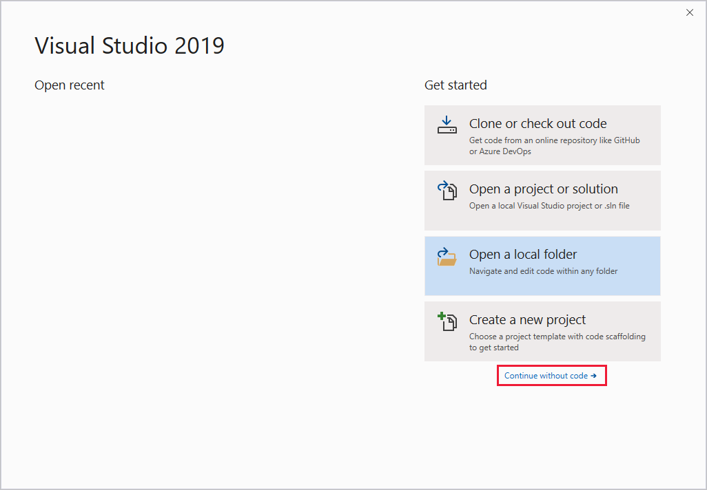
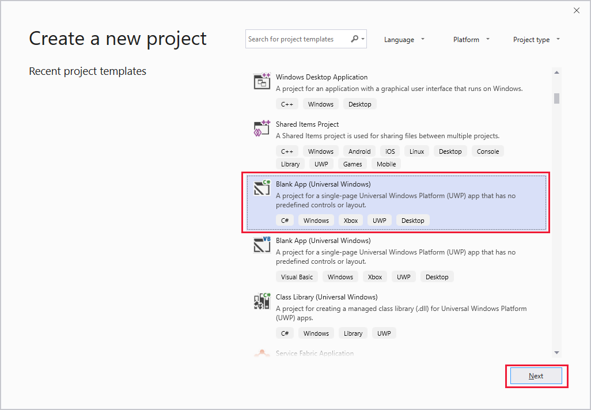
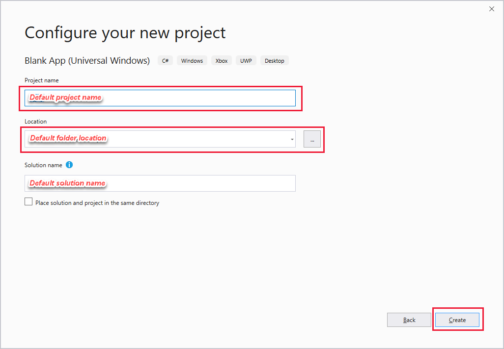
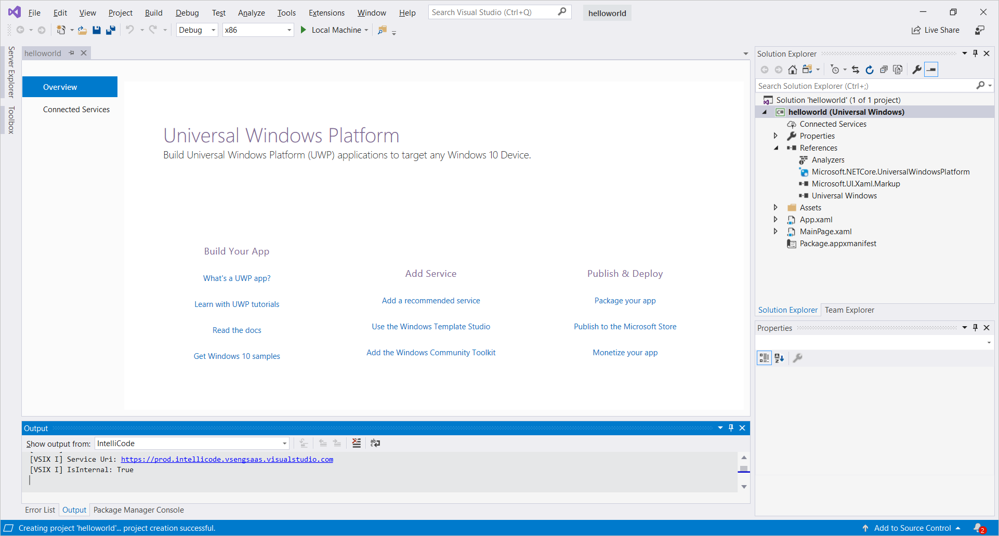
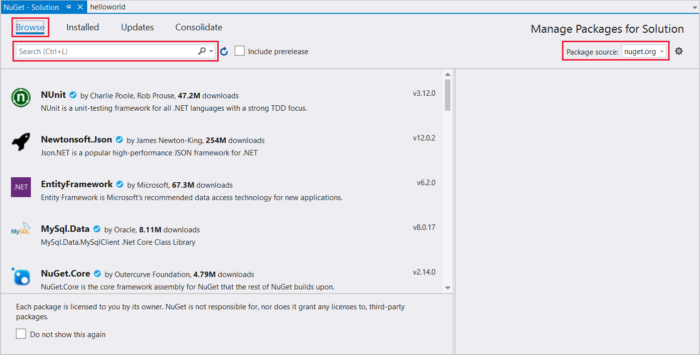

To create a Visual Studio project for Universal Windows Platform (UWP) development, you need to set up Visual Studio development options, create the project, select the target architecture, set up audio capture, and install the Speech SDK.

### Set up Visual Studio development options

To start, make sure you're set up correctly in Visual Studio for UWP development:

1. Open Visual Studio 2019 to display the **Start** window.

   

1. Select **Continue without code** to go to the Visual Studio IDE.

1. From the Visual Studio menu bar, select **Tools** > **Get Tools and Features** to open Visual Studio Installer and view the **Modifying** dialog box.

   

1. In the **Workloads** tab, under **Windows**, find the **Universal Windows Platform development** workload. If the check box next to that workload is already selected, close the **Modifying** dialog box, and go to step 6.

1. Select the **Universal Windows Platform development** check box, select **Modify**, and then in the **Before we get started** dialog box, select **Continue** to install the UWP development workload. Installation of the new feature may take a while.

1. Close Visual Studio Installer.

### Create the project and select the target architecture

Next, create your project:

1. In the Visual Studio menu bar, choose **File** > **New** > **Project** to display the **Create a new project** window.

   

1. Find and select **Blank App (Universal Windows)**. Make sure that you select the C# version of this project type (as opposed to Visual Basic).

1. Select **Next** to display the **Configure your new project** screen.

   

1. In **Project name**, enter `helloworld`.

1. In **Location**, navigate to and select or create the folder to save your project in.

1. Select **Create** to go to the **New Universal Windows Platform Project** window.

   

1. In **Minimum version** (the second drop-down box), choose **Windows 10 Fall Creators Update (10.0; Build 16299)**, which is the minimum requirement for the Speech SDK.

1. In **Target version** (the first drop-down box), choose a value identical to or later than the value in **Minimum version**.

1. Select **OK**. You're returned to the Visual Studio IDE, with the new project created and visible in the **Solution Explorer** pane.

   

Now select your target platform architecture. In the Visual Studio toolbar, find the **Solution Platforms** drop-down box. (If you don't see it, choose **View** > **Toolbars** > **Standard** to display the toolbar containing **Solution Platforms**.) If you're running 64-bit Windows, choose **x64** in the drop-down box. 64-bit Windows can also run 32-bit applications, so you can choose **x86** if you prefer.

> [!NOTE]
> The Speech SDK only supports Intel-compatible processors. ARM processors are currently not supported.

### Set up audio capture

Allow the project to capture audio input:

1. In **Solution Explorer**, double-click **Package.appxmanifest** to open the package application manifest.

1. Select the **Capabilities** tab.

   

1. Select the box for the **Microphone** capability.

1. From the menu bar, choose **File** > **Save Package.appxmanifest** to save your changes.

### Install the Speech SDK

Finally, install the [Speech SDK NuGet package](https://aka.ms/csspeech/nuget), and reference the Speech SDK in your project:

1. In **Solution Explorer**, right-click your solution, and choose **Manage NuGet Packages for Solution** to go to the **NuGet - Solution** window.

1. Select **Browse**.

   

1. In **Package source**, choose **nuget.org**.

1. In the **Search** box, enter `Microsoft.CognitiveServices.Speech`, and then choose that package after it appears in the search results.

   

1. In the package status pane next to the search results, select your **helloworld** project.

1. Select **Install**.

1. In the **Preview Changes** dialog box, select **OK**.

1. In the **License Acceptance** dialog box, view the license, and then select **I Accept**. The package installation begins, and when installation is complete, the **Output** pane displays a message similar to the following text: `Successfully installed 'Microsoft.CognitiveServices.Speech 1.12.1' to helloworld`.
