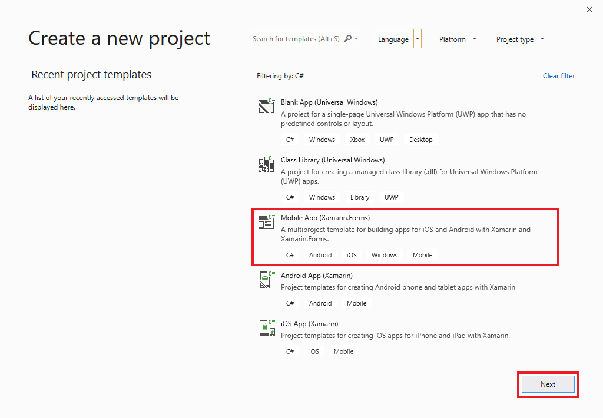
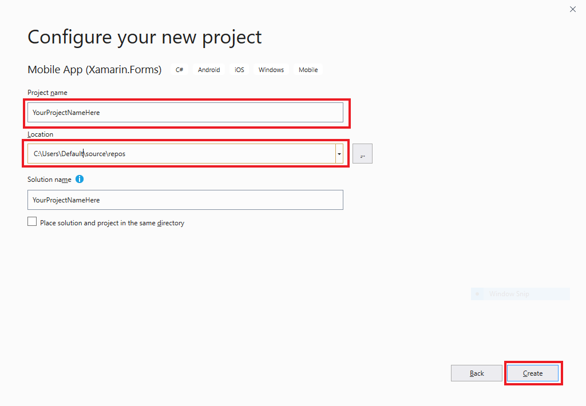
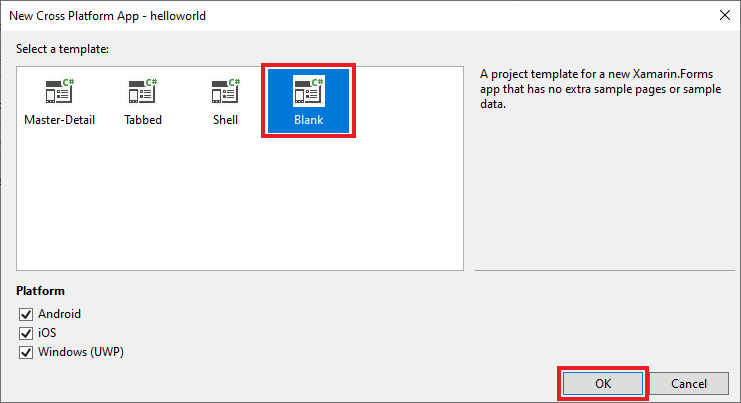
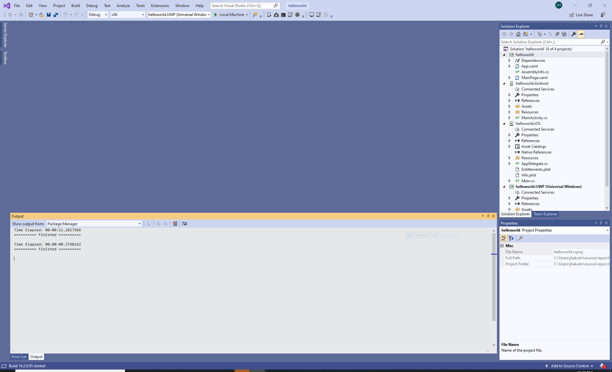
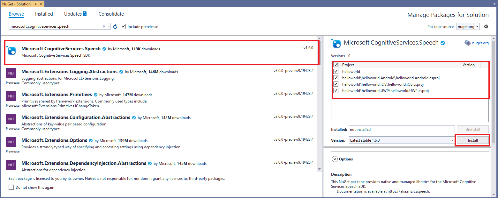

To create a Visual Studio project for cross-platform mobile app .NET development with Xamarin, you need to:
- Set up Visual Studio development options.
- Create the project and select the target architecture. 
- Install the Speech SDK.

### Set up Visual Studio development options

To start, make sure you're set up correctly in Visual Studio for cross-platform mobile development with .NET:

1. Open Visual Studio 2019.

1. From the Visual Studio menu bar, select **Tools** > **Get Tools and Features** to open Visual Studio Installer and view the **Modifying** dialog box.

   

1. On the **Workloads** tab, under **Windows**, find the **Mobile development with .NET** workload. If the check box next to that workload is already selected, close the **Modifying** dialog box, and go to step 5.

1. Select the **Mobile development with .NET** check box, and select **Modify**. In the **Before we get started** dialog box, select **Continue** to install the mobile development with .NET workload. Installation of the new feature might take a while.

1. Close Visual Studio Installer.

### Create the project

1. On the Visual Studio menu bar, select **File** > **New** > **Project** to display the **Create a new project** window.

   

1. Find and select **Mobile App (Xamarin.Forms)**.

1. Select **Next** to display the **Configure your new project** screen.

   

1. In **Project name**, enter *helloworld*.

1. In **Location**, go to and select or create the folder to save your project in.

1. Select **Create** to go to the **New Mobile App Xamarin Forms Project** window.

   

1. Select the **Blank** template.

1. In **Platform**, select the boxes for **Android**, **iOS**, and **Windows (UWP)**.

1. Select **OK**. You're returned to the Visual Studio IDE, with the new project created and visible in the **Solution Explorer** pane.

   

Now select your target platform architecture and startup project. On the Visual Studio toolbar, find the **Solution Platforms** drop-down box. (If you don't see it, select **View** > **Toolbars** > **Standard** to display the toolbar that contains **Solution Platforms**.) If you're running 64-bit Windows, select **x64** in the drop-down box. You can select **x86** if you want because 64-bit Windows also can run 32-bit applications. In the **Start-up Projects** drop-down box, set **helloworld.UWP (Universal Windows)**.

### Install the Speech SDK

Install the [Speech SDK NuGet package](https://aka.ms/csspeech/nuget), and reference the Speech SDK in your project.

1. In **Solution Explorer**, right-click your solution. Select **Manage NuGet Packages for Solution** to go to the **NuGet - Solution** window.

1. Select **Browse**.

   

1. In **Package source**, select nuget.org.

1. In the **Search** box, enter *Microsoft.CognitiveServices.Speech*. Then select that package after it appears in the search results.

   

   > [!NOTE] 
   > The iOS library inside `Microsoft.CognitiveServices.Speech` NuGet doesn't have bitcode enabled. If you need the bitcode library enabled for your application, use `Microsoft.CognitiveServices.Speech.Xamarin.iOS` NuGet for the iOS project specifically.

1. In the package status pane next to the search results, select all projects: **helloworld**, **helloworld.Android**, **helloworld.iOS**, and **helloworld.UWP**.

1. Select **Install**.

1. In the **Preview Changes** dialog box, select **OK**.

1. In the **License Acceptance** dialog box, view the license, and then select **I Accept**. Install the Speech SDK package reference to all projects. After installation is completed successfully, you might see the following warning for helloworld.iOS. This is a known issue and should not affect your app functionality.

   > Could not resolve reference "C:\Users\Default\.nuget\packages\microsoft.cognitiveservices.speech\1.7.0\build\Xamarin.iOS\libMicrosoft.CognitiveServices.Speech.core.a". If this reference is required by your code, you may get compilation errors.
