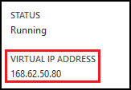

This article shows you how to configure HTTPS for a web app in Azure App Service. It does not cover client certificate authentication; for information about that, see [How To Configure TLS Mutual Authentication for Web Apps](../articles/app-service-web/app-service-web-configure-tls-mutual-auth.md).

By default, Azure already enables HTTPS for your app with a wildcard certificate for  the \*.azurewebsites.net domain. If you don't plan to configure a custom domain, then you can benefit from the default HTTPS certificate. However, like [all wildcard domains](https://casecurity.org/2014/02/26/pros-and-cons-of-single-domain-multi-domain-and-wildcard-certificates/), it is not as secure as using a custom domain with your own certificate.   

The rest of this document provides details on enabling HTTPS for custom domains, such as **contoso.com**, **www.contoso.com**, or **\*.contoso.com**

<a name="bkmk_domainname"></a>
## Enable SSL for your custom domain

To enable HTTPS for a custom domain, such as **contoso.com**, you must first [configure a custom domain name in Azure App Service](../articles/app-service-web/web-sites-custom-domain-name.md). Then, you do the following:

1. [Get an SSL certificate](#bkmk_getcert)
2. [Configure Standard or Premium pricing tier](#bkmk_standardmode)
2. [Configure SSL in your app](#bkmk_configuressl)
3. [Enforce SSL on your app](#bkmk_enforce) (Optional)

If you need more help at any point in this article, you can contact the Azure experts on [the MSDN Azure and the Stack Overflow forums](https://azure.microsoft.com/support/forums/). Alternatively, you can also file an Azure support incident. Go to the [Azure Support site](https://azure.microsoft.com/support/options/) and click on **Get Support**.

<a name="bkmk_getcert"></a>
## 1. Get an SSL certificate

Before requesting an SSL certificate you must first determine which domain names will be secured by the certificate. This will determine what type of certificate you must obtain. If you just need to secure a single domain name such as **contoso.com** or **www.contoso.com** a basic certificate is sufficient. If you need to secure multiple domain names, such as **contoso.com**, **www.contoso.com**, and **mail.contoso.com**, then you can get a [wildcard certificate](http://en.wikipedia.org/wiki/Wildcard_certificate), or a certificate with [Subject Alternate Name](http://en.wikipedia.org/wiki/SubjectAltName) (subjectAltName).

SSL certificates used with App Service must be signed by a [Certificate Authority](http://en.wikipedia.org/wiki/Certificate_authority) (CA). If you do not already have one, you will need to obtain one from a company that issues SSL certificates. For a list of Certificate Authorities, see [Windows and Windows Phone 8 SSL Root Certificate Program (Members CAs)][cas] on the Microsoft TechNet Wiki.

The certificate must meet the following requirements for SSL certificates in Azure:

* The certificate must contain a private key.
* The certificate must be created for key exchange, exportable to a Personal Information Exchange (.pfx) file.
* The certificate's subject name must match the domain used to access the app. If you need to serve multiple domains with this certificate, you will need to use a wildcard value or specify subjectAltName values as discussed previously.
* The certificate should use a minimum of 2048-bit encryption.
* Certificates issued from private CA servers are not supported by Azure App Service.

To get an SSL certificate for use with Azure App Service, you submit a Certificate Signing Request (CSR) to a Certificate Authority and then generate a .pfx file from the certificate you receive back. You can do this using the tool of your choice. Below are some of the common ways to get a certificate:

- [Get a certificate using Certreq.exe](#bkmk_certreq)
- [Get a certificate using IIS Manager](#bkmk_iismgr)
- [Get a certificate using OpenSSL](#bkmk_openssl)
- [Get a SubjectAltName certificate using OpenSSL](#bkmk_subjectaltname)
- [Generate self-signed certificates (for testing only)](#bkmk_selfsigned)

> [AZURE.NOTE] When following the steps, you will be prompted to enter a **Common Name**, such as `www.contoso.com`. For wildcard certificates, this value should be \*.domainname (for example, \*.contoso.com). If you need to support both a wildcard name like \*.contoso.com and a root domain name like contoso.com, you can use a wildcard subjectAltName certificate.
>
> Elliptic Curve Cryptography (ECC) certificates are supported with Azure App Service; however, they are relatively new and you should work with your CA on the exact steps to create the CSR.

You may also need to obtain **[intermediate certificates](http://en.wikipedia.org/wiki/Intermediate_certificate_authorities)** (also known as chain certificates), if these are used by your CA. The use of intermediate certificates is considered more secure than 'unchained certificates', so it is common for a CA to use them. Intermediate certificates are often provided as a separate download from the CAs website. This article provides steps to ensure that any intermediate certificates are merged with the certificate uploaded to your apps.

> [AZURE.NOTE]
>
> In case your CA uses intermediate certificates each of them must be installed along with the certificate issued for your domain. Failing to install any of the intermediate certificates may cause hard to reproduce interoperability problems for some clients.

<a name="bkmk_certreq"></a>
### Get a certificate using Certreq.exe (Windows only)

Certreq.exe is Windows utility for creating certificate requests. It has been part of the base Windows installation since Windows XP/Windows Server 2000, so should be available on recent Windows systems. Use the following steps to obtain an SSL certificate using certreq.exe.

1. Open **Notepad** and create a new document that contains the following. Replace **mysite.com** on the Subject line with the custom domain name of your app. For example, Subject = "CN=www.contoso.com".

		[NewRequest]
		Subject = "CN=mysite.com"
		Exportable = TRUE
		KeyLength = 2048
		KeySpec = 1
		KeyUsage = 0xA0
		MachineKeySet = True
		ProviderName = "Microsoft RSA SChannel Cryptographic Provider"
		ProviderType = 12

		[EnhancedKeyUsageExtension]
		OID=1.3.6.1.5.5.7.3.1

	For more information on the options specified above, as well as other available options, see the [Certreq reference documentation](http://technet.microsoft.com/library/cc725793.aspx).

2. Save the text file as **myrequest.txt**.

3. From the **Start Screen** or **Start Menu**, run **cmd.exe**.

4. From the command prompt, use the following command to create the certificate request file:

		certreq -new \path\to\myrequest.txt \path\to\create\myrequest.csr

	Specify the path to the **myrequest.txt** file created in step 1, and the path to use when creating the **myrequest.csr** file.

5. Submit the **myrequest.csr** to a Certificate Authority to obtain an SSL certificate. This may involve uploading the file, or opening the file in Notepad and pasting the contents directly into a web form.

	For a list of Certificate Authorities, see [Windows and Windows Phone 8 SSL Root Certificate Program (Members CAs)][cas] on the Microsoft TechNet Wiki.

6. Once the Certificate Authority has provided you with a certificate (.CER) file, save this file to the computer used to generate the request, and then use the following command to accept the request and complete the certificate generation process.

		certreq -accept -user mycert.cer

	In this case, the **mycert.cer** certificate received from the Certificate Authority will be used to complete the signature of the certificate. No file will be created; instead, the certificate will be stored in the Windows certificate store.

6. If your CA uses intermediate certificates, you must install these certificates before exporting the certificate in the next steps. Usually these certificates are provided as a separate download from your CA, and are provided in several formats for different web server types. Select the version that is provided for Microsoft IIS.

	Once you have downloaded the certificate, right click on it in explorer and select **Install certificate**. Use the default values in the **Certificate Import Wizard**, and continue selecting **Next** until the import has completed.

7. To export the certificate from the certificate store, run **certmgr.msc** from the **Start Screen** or **Start Menu**. When **Certificate Manager** appears, expand the **Personal** folder, and then select **Certificates**. In the **Issued To** field, look for an entry with the custom domain name you requested a certificate for. In the **Issued By** field, it should list the Certificate Authority you used for this certificate.

	![insert image of cert manager here][certmgr]

9. Right click the certificate and select **All Tasks**, and then select **Export**. In the **Certificate Export Wizard**, click **Next** and then select **Yes, export the private key**. Click **Next**.

	![Export the private key][certwiz1]

10. Select **Personal Information Exchange - PKCS #12**, **Include all certificates in the certificate chain**, and **Export all extended properties**. Click **Next**.

	![include all certs and extended properties][certwiz2]

11. Select **Password**, and then enter and confirm the password. Click **Next**.

	![specify a password][certwiz3]

12. Provide a path and filename that will contain the exported certificate. The filename should have an extension of **.pfx**. Click **Next** to complete the process.

	![provide a file path][certwiz4]

You can now upload the exported PFX file to your app in Azure App Service.

<a name="bkmk_openssl"></a>
### Get a certificate using OpenSSL

1. Generate a private key and Certificate Signing Request by using the following from a command-line, bash or terminal session:

		openssl req -new -nodes -keyout myserver.key -out server.csr -newkey rsa:2048

2. When prompted, enter the appropriate information. For example:

 		Country Name (2 letter code)
        State or Province Name (full name) []: Washington
        Locality Name (eg, city) []: Redmond
        Organization Name (eg, company) []: Microsoft
        Organizational Unit Name (eg, section) []: Azure
        Common Name (eg, YOUR name) []: www.microsoft.com
        Email Address []:

		Please enter the following 'extra' attributes to be sent with your certificate request

       	A challenge password []:

	Once this process completes, you should have two files; **myserver.key** and **server.csr**. The **server.csr** contains the Certificate Signing Request.

3. Submit your CSR to a Certificate Authority to obtain an SSL certificate. For a list of Certificate Authorities, see [Windows and Windows Phone 8 SSL Root Certificate Program (Members CAs)][cas] on the Microsoft TechNet Wiki.

4. Once you have obtained a certificate from a CA, save it to a file named **myserver.crt**. If your CA provided the certificate in a text format, simply paste the certificate text into the **myserver.crt** file. The file contents should be similar to the following when viewed in a text editor:

		-----BEGIN CERTIFICATE-----
		MIIDJDCCAgwCCQCpCY4o1LBQuzANBgkqhkiG9w0BAQUFADBUMQswCQYDVQQGEwJV
		UzELMAkGA1UECBMCV0ExEDAOBgNVBAcTB1JlZG1vbmQxEDAOBgNVBAsTB0NvbnRv
		c28xFDASBgNVBAMTC2NvbnRvc28uY29tMB4XDTE0MDExNjE1MzIyM1oXDTE1MDEx
		NjE1MzIyM1owVDELMAkGA1UEBhMCVVMxCzAJBgNVBAgTAldBMRAwDgYDVQQHEwdS
		ZWRtb25kMRAwDgYDVQQLEwdDb250b3NvMRQwEgYDVQQDEwtjb250b3NvLmNvbTCC
		ASIwDQYJKoZIhvcNAQEBBQADggEPADCCAQoCggEBAN96hBX5EDgULtWkCRK7DMM3
		enae1LT9fXqGlbA7ScFvFivGvOLEqEPD//eLGsf15OYHFOQHK1hwgyfXa9sEDPMT
		3AsF3iWyF7FiEoR/qV6LdKjeQicJ2cXjGwf3G5vPoIaYifI5r0lhgOUqBxzaBDZ4
		xMgCh2yv7NavI17BHlWyQo90gS2X5glYGRhzY/fGp10BeUEgIs3Se0kQfBQOFUYb
		ktA6802lod5K0OxlQy4Oc8kfxTDf8AF2SPQ6BL7xxWrNl/Q2DuEEemjuMnLNxmeA
		Ik2+6Z6+WdvJoRxqHhleoL8ftOpWR20ToiZXCPo+fcmLod4ejsG5qjBlztVY4qsC
		AwEAATANBgkqhkiG9w0BAQUFAAOCAQEAVcM9AeeNFv2li69qBZLGDuK0NDHD3zhK
		Y0nDkqucgjE2QKUuvVSPodz8qwHnKoPwnSrTn8CRjW1gFq5qWEO50dGWgyLR8Wy1
		F69DYsEzodG+shv/G+vHJZg9QzutsJTB/Q8OoUCSnQS1PSPZP7RbvDV9b7Gx+gtg
		7kQ55j3A5vOrpI8N9CwdPuimtu6X8Ylw9ejWZsnyy0FMeOPpK3WTkDMxwwGxkU3Y
		lCRTzkv6vnHrlYQxyBLOSafCB1RWinN/slcWSLHADB6R+HeMiVKkFpooT+ghtii1
		A9PdUQIhK9bdaFicXPBYZ6AgNVuGtfwyuS5V6ucm7RE6+qf+QjXNFg==
		-----END CERTIFICATE-----

	Save the file.

5. From the command-line, Bash or terminal session, use the following command to convert the **myserver.key** and **myserver.crt** into **myserver.pfx**, which is the format required by Azure App Service:

		openssl pkcs12 -export -out myserver.pfx -inkey myserver.key -in myserver.crt

	When prompted, enter a password to secure the .pfx file.

	> [AZURE.NOTE] If your CA uses intermediate certificates, you must install these certificates before exporting the certificate in the next step. Usually these certificates are provided as a separate download from your CA, and are provided in several formats for different web server types. Select the version that is provided as a PEM file (.pem file extension.)
	>
	> The follow command demonstrates how to create a .pfx file that includes intermediate certificates, which are contained in the **intermediate-cets.pem** file:  
	>
	>
	`````
	openssl pkcs12 -chain -export -out myserver.pfx -inkey myserver.key -in myserver.crt -certfile intermediate-cets.pem
	`````

	After running this command, you should have a **myserver.pfx** file suitable for use with Azure App Service.

<a name="bkmk_iismgr"></a>
### Get a certificate using the IIS Manager

If you are familiar with IIS Manager, you can use it to generate a certificate that can be used with Azure App Service.

1. Generate a CSR with IIS Manager to send to the Certificate Authority. For more information on generating a CSR, see [Request an Internet Server Certificate (IIS 7)][iiscsr].

2. Submit your CSR to a Certificate Authority to obtain an SSL certificate. For a list of Certificate Authorities, see [Windows and Windows Phone 8 SSL Root Certificate Program (Members CAs)][cas] on the Microsoft TechNet Wiki.

3. Complete the CSR with the certificate provided by the Certificate Authority vendor. For more information on completing the CSR, see [Install an Internet Server Certificate (IIS 7)][installcertiis].

4. If your CA uses intermediate certificates, you must install these certificates before exporting the certificate in the next step. Usually these certificates are provided as a separate download from your CA, and are provided in several formats for different web server types. Select the version that is provided for Microsoft IIS.

	Once you have downloaded the certificate, right click on it in explorer and select **Install certificate**. Use the default values in the **Certificate Import Wizard**, and continue selecting **Next** until the import has completed.

4. Export the certificate from IIS Manager For more information on exporting the certificate, see [Export a Server Certificate (IIS 7)][exportcertiis]. The exported file will be used in later steps to upload to Azure for use with your app.

	> [AZURE.NOTE] During the export process, be sure to select the option <strong>Yes, export the private key</strong>. This will include the private key in the exported certificate.

	> During the export process, be sure to select the option **include all certs in the certification path** and **Export all extended properties**. This will include any intermediate certificates in the exported certificate.

<a name="bkmk_subjectaltname"></a>
### Get a SubjectAltName certificate using OpenSSL

OpenSSL can be used to create a certificate request that uses the SubjectAltName extension to support multiple domain names with a single certificate, however it requires a configuration file. The following steps walk through creating a configuration file, and then using it to request a certificate.

1. Create a new file named __sancert.cnf__ and use the following as the contents of the file:

		# -------------- BEGIN custom sancert.cnf -----
		HOME = .
		oid_section = new_oids
		[ new_oids ]
		[ req ]
		default_days = 730
		distinguished_name = req_distinguished_name
		encrypt_key = no
		string_mask = nombstr
		req_extensions = v3_req # Extensions to add to certificate request
		[ req_distinguished_name ]
		countryName = Country Name (2 letter code)
		countryName_default =
		stateOrProvinceName = State or Province Name (full name)
		stateOrProvinceName_default =
		localityName = Locality Name (eg, city)
		localityName_default =
		organizationalUnitName  = Organizational Unit Name (eg, section)
		organizationalUnitName_default  =
		commonName              = Your common name (eg, domain name)
		commonName_default      = www.mydomain.com
		commonName_max = 64
		[ v3_req ]
		subjectAltName=DNS:ftp.mydomain.com,DNS:blog.mydomain.com,DNS:*.mydomain.com
		# -------------- END custom sancert.cnf -----

	Note the line that begins with 'subjectAltName'. Replace the domain names currently listed with domain names you wish to support in addition to the common name. For example:

		subjectAltName=DNS:sales.contoso.com,DNS:support.contoso.com,DNS:fabrikam.com

	You do not need to change the commonName_default field, as you will be prompted to enter your common name in one of the following steps.

2. Save the __sancert.cnf__ file.

1. Generate a private key and Certificate Signing Request by using the sancert.cnf configuration file. From a bash or terminal session, use the following command:

		openssl req -new -nodes -keyout myserver.key -out server.csr -newkey rsa:2048 -config sancert.cnf

2. When prompted, enter the appropriate information. For example:

 		Country Name (2 letter code) []: US
        State or Province Name (full name) []: Washington
        Locality Name (eg, city) []: Redmond
        Organizational Unit Name (eg, section) []: Azure
        Your common name (eg, domain name) []: www.microsoft.com


	Once this process completes, you should have two files; **myserver.key** and **server.csr**. The **server.csr** contains the Certificate Signing Request.

3. Submit your CSR to a Certificate Authority to obtain an SSL certificate. For a list of Certificate Authorities, see [Windows and Windows Phone 8 SSL Root Certificate Program (Members CAs)][cas] on the Microsoft TechNet Wiki.

4. Once you have obtained a certificate from a CA, save it to a file named **myserver.crt**. If your CA provided the certificate in a text format, simply paste the certificate text into the **myserver.crt** file. The file contents should be similar to the following when viewed in a text editor:

		-----BEGIN CERTIFICATE-----
		MIIDJDCCAgwCCQCpCY4o1LBQuzANBgkqhkiG9w0BAQUFADBUMQswCQYDVQQGEwJV
		UzELMAkGA1UECBMCV0ExEDAOBgNVBAcTB1JlZG1vbmQxEDAOBgNVBAsTB0NvbnRv
		c28xFDASBgNVBAMTC2NvbnRvc28uY29tMB4XDTE0MDExNjE1MzIyM1oXDTE1MDEx
		NjE1MzIyM1owVDELMAkGA1UEBhMCVVMxCzAJBgNVBAgTAldBMRAwDgYDVQQHEwdS
		ZWRtb25kMRAwDgYDVQQLEwdDb250b3NvMRQwEgYDVQQDEwtjb250b3NvLmNvbTCC
		ASIwDQYJKoZIhvcNAQEBBQADggEPADCCAQoCggEBAN96hBX5EDgULtWkCRK7DMM3
		enae1LT9fXqGlbA7ScFvFivGvOLEqEPD//eLGsf15OYHFOQHK1hwgyfXa9sEDPMT
		3AsF3iWyF7FiEoR/qV6LdKjeQicJ2cXjGwf3G5vPoIaYifI5r0lhgOUqBxzaBDZ4
		xMgCh2yv7NavI17BHlWyQo90gS2X5glYGRhzY/fGp10BeUEgIs3Se0kQfBQOFUYb
		ktA6802lod5K0OxlQy4Oc8kfxTDf8AF2SPQ6BL7xxWrNl/Q2DuEEemjuMnLNxmeA
		Ik2+6Z6+WdvJoRxqHhleoL8ftOpWR20ToiZXCPo+fcmLod4ejsG5qjBlztVY4qsC
		AwEAATANBgkqhkiG9w0BAQUFAAOCAQEAVcM9AeeNFv2li69qBZLGDuK0NDHD3zhK
		Y0nDkqucgjE2QKUuvVSPodz8qwHnKoPwnSrTn8CRjW1gFq5qWEO50dGWgyLR8Wy1
		F69DYsEzodG+shv/G+vHJZg9QzutsJTB/Q8OoUCSnQS1PSPZP7RbvDV9b7Gx+gtg
		7kQ55j3A5vOrpI8N9CwdPuimtu6X8Ylw9ejWZsnyy0FMeOPpK3WTkDMxwwGxkU3Y
		lCRTzkv6vnHrlYQxyBLOSafCB1RWinN/slcWSLHADB6R+HeMiVKkFpooT+ghtii1
		A9PdUQIhK9bdaFicXPBYZ6AgNVuGtfwyuS5V6ucm7RE6+qf+QjXNFg==
		-----END CERTIFICATE-----

	Save the file.

5. From the command-line, Bash or terminal session, use the following command to convert the **myserver.key** and **myserver.crt** into **myserver.pfx**, which is the format required by Azure App Service:

		openssl pkcs12 -export -out myserver.pfx -inkey myserver.key -in myserver.crt

	When prompted, enter a password to secure the .pfx file.

	> [AZURE.NOTE] If your CA uses intermediate certificates, you must install these certificates before exporting the certificate in the next step. Usually these certificates are provided as a separate download from your CA, and are provided in several formats for different web server types. Select the version that is provided as a PEM file (.pem file extension.)  
	>
	> The follow command demonstrates how to create a .pfx file that includes intermediate certificates, which are contained in the **intermediate-cets.pem** file:  
	>
	>
	`````
	openssl pkcs12 -chain -export -out myserver.pfx -inkey myserver.key -in myserver.crt -certfile intermediate-cets.pem
	`````

	After running this command, you should have a **myserver.pfx** file suitable for use with Azure App Service.

<a name="bkmk_selfsigned"></a>
### Generate a self-signed certificate (for testing only)

In some cases you may wish to obtain a certificate for testing, and delay purchasing one from a trusted CA until you go into production. Self-signed certificates can fill this gap. A self-signed certificate is a certificate you create and sign as if you were a Certificate Authority. While this certificate can be used to secure an app, most browsers will return errors when visiting the app as the certificate was not signed by a trusted CA. Some browsers may even refuse to allow you to view the app.

- [Generate a self-signed certificate using makecert](#bkmk_ssmakecert)
- [Generate a self-signed certificate using OpenSSL](#bkmk_ssopenssl)

<a name="bkmk_ssmakecert"></a>
#### Generate a self-signed certificate using makecert ####

You can create a test certificate from a Windows system that has Visual Studio installed by performing the following steps:

1. From the **Start Menu** or **Start Screen**, search for **Developer Command Prompt**. Finally, right-click **Developer Command Prompt** and select **Run As Administrator**.

	If you receive a User Account Control dialog, select **Yes** to continue.

2. From the Developer Command Prompt, use the following command to create a new self-signed certificate. You must substitute **serverdnsname** with the DNS of your app.

		makecert -r -pe -b 01/01/2013 -e 01/01/2014 -eku 1.3.6.1.5.5.7.3.1 -ss My -n CN=serverdnsname -sky exchange -sp "Microsoft RSA SChannel Cryptographic Provider" -sy 12 -len 2048

	This command will create a certificate that is good between the dates of 01/01/2013 and 01/01/2014, and will store the location in the CurrentUser certificate store.

3. From the **Start Menu** or **Start Screen**, search for **Windows PowerShell** and start this application.

4. From the Windows PowerShell prompt, use the following commands to export the certificate created previously:

		$mypwd = ConvertTo-SecureString -String "password" -Force -AsPlainText
		get-childitem cert:\currentuser\my -dnsname serverdnsname | export-pfxcertificate -filepath file-to-export-to.pfx -password $mypwd

	This stores the specified password as a secure string in $mypwd, then finds the certificate by using the DNS name specified by the **dnsname** parameter, and exports to the file specified by the **filepath** parameter. The secure string containing the password is used to secure the exported file.

<a name="bkmk_ssopenssl"></a>
####Generate a self-signed certificate using OpenSSL ####

1. Create a new document named **serverauth.cnf**, using the following as the contents of this file:

        [ req ]
        default_bits           = 2048
        default_keyfile        = privkey.pem
        distinguished_name     = req_distinguished_name
        attributes             = req_attributes
        x509_extensions        = v3_ca

        [ req_distinguished_name ]
        countryName			= Country Name (2 letter code)
        countryName_min			= 2
        countryName_max			= 2
        stateOrProvinceName		= State or Province Name (full name)
        localityName			= Locality Name (eg, city)
        0.organizationName		= Organization Name (eg, company)
        organizationalUnitName		= Organizational Unit Name (eg, section)
        commonName			= Common Name (eg, your app's domain name)
        commonName_max			= 64
        emailAddress			= Email Address
        emailAddress_max		= 40

        [ req_attributes ]
        challengePassword		= A challenge password
        challengePassword_min		= 4
        challengePassword_max		= 20

        [ v3_ca ]
         subjectKeyIdentifier=hash
         authorityKeyIdentifier=keyid:always,issuer:always
         basicConstraints = CA:false
         keyUsage=nonRepudiation, digitalSignature, keyEncipherment
         extendedKeyUsage = serverAuth

	This specifies the configuration settings required to produce an SSL certificate that can be used by Azure App Service.

2. Generate a new self-signed certificate by using the following from a command-line, bash or terminal session:

		openssl req -x509 -nodes -days 365 -newkey rsa:2048 -keyout myserver.key -out myserver.crt -config serverauth.cnf

	This creates a new certificate using the configuration settings specified in the **serverauth.cnf** file.

3. To export the certificate to a .PFX file that can be uploaded to an app in Azure App Service, use the following command:

		openssl pkcs12 -export -out myserver.pfx -inkey myserver.key -in myserver.crt

	When prompted, enter a password to secure the .pfx file.

	The **myserver.pfx** produced by this command can be used to secure your app for testing purposes.

<a name="bkmk_standardmode"></a>
## 2. Configure Standard or Premium pricing tier

Enabling HTTPS for a custom domain is only available for the **Standard** and **Premium** pricing tiers in Azure App Service. Use the following steps to switch your App Service plan to **Standard** tier.

> [AZURE.NOTE] Before switching an app from the **Free** tier to **Standard** tier, you should remove spending caps in place for your subscription, otherwise you risk your app becoming unavailable if you reach your caps before the billing period ends. For more information on shared and **Standard** tier, see [Pricing Details][pricing].

1.	In your browser, open the [Azure Portal](https://portal.azure.com).
	
2.	Click the **App Service** option on the left side of the page.

4.	Click the name of your app.

5.	In the **Essentials** page, click **Settings**.

6.	Click **Scale Up**
	
	![The scale tab][scale]

7.	In the **Scale Up** section, set the App Service plan mode by clicking **Select**.

	> [AZURE.NOTE] If you receive a "Configuring scale for web app '&lt;app name&gt;' failed" error you can use the details button to get more information. You may receive a "Not enough available standard instance servers to satisfy this request." error. If you receive this error, please contact [Azure support](/support/options/).

<a name="bkmk_configuressl"></a>
## 3. Configure SSL in your app

Before performing the steps in this section, you must have associated a custom domain name with your app. For more information, see [Configuring a custom domain name for a web app][customdomain].

1.	In your browser, open the [Azure Portal](https://portal.azure.com).

2.	Click the **App Service** option on the left side of the page.

4.	Click the name of your app.

5.	In the **Essentials** page, click **Settings**.

6.	Click **Custom domains and SSL**.

	![The config tab][configure]

7.	In the **certificates** section, click **Upload**

8.	Using the **Upload a certificate** dialog, select the .pfx certificate file created earlier using the IIS Manager or OpenSSL. Specify the password, if any, that was used to secure the .pfx file. Finally, click the **Save** to upload the certificate.

	![ssl upload][uploadcert]

9. In the **ssl bindings** section of the **SSL Settings** tab, use the dropdowns to select the domain name to secure with SSL, and the certificate to use. You may also select whether to use [Server Name Indication][sni] (SNI) or IP based SSL.

	![ssl bindings][sslbindings]

	* IP based SSL associates a certificate with a domain name by mapping the dedicated public IP address of the server to the domain name. This requires each domain name (contoso.com, fabricam.com, etc.) associated with your service to have a dedicated IP address. This is the traditional method of associating SSL certificates with a web server.

	* SNI based SSL is an extension to SSL and [Transport Layer Security][tls] (TLS) that allows multiple domains to share the same IP address, with separate security certificates for each domain. Most modern browsers (including Internet Explorer, Chrome, Firefox and Opera) support SNI, however older browsers may not support SNI. For more information on SNI, see the [Server Name Indication][sni] article on Wikipedia.

10. Click **Save** to save the changes and enable SSL.

> [AZURE.NOTE] If you selected **IP based SSL** and your custom domain is configured using an A record, you must perform the following additional steps:
>
> 1. After you have configured an IP based SSL binding, a dedicated IP address is assigned to your app. You can find this IP address on the **Dashboard** page of your app, in the **quick glance** section. It will be listed as **Virtual IP Address**:
>    
>     
>    
>     Note that this IP address will be different than the virtual IP address used previously to configure the A record for your domain. If you are configured to use SNI based SSL, or are not configured to use SSL, no address will be listed for this entry.
>
> 2. Using the tools provided by your domain name registrar, modify the A record for your custom domain name to point to the IP address from the previous step.

<br>
If you add an **IP based SSL** to a Web App that already had an **SNI binding** with a different certificate, as soon as IP SSL is enabled for the Web App, we'll remap the site's hostname to that IP address, so if any other hostname is CNAME'd to that site's hostname it will also get traffic on IP SSL address. 

For such cases we created one more DNS entry: sni.&lt;nameofyourWebApp&gt;.azurewebsites.net where &lt;nameofyourWebApp&gt; is the name of your Azure App Service Web App. So, you should change your DNS records pointing to the name used in your SNI binding so that it points to sni.&lt;nameofyourWebApp&gt;.azurewebsites.net instead.

At this point, you should be able to visit your app using `HTTPS://` instead of `HTTP://` to verify that the certificate has been configured correctly.

<a name="bkmk_enforce"></a>
## 4. Enforce HTTPS on your app

Azure App Service do *not* enforce HTTPS. Visitors may still access your app using HTTP, which may compromise your app's security. If you want to enforce HTTPS for your app, you can use the **URL Rewrite** module. The URL Rewrite module is included with Azure App Service, and enables you to define rules that are applied to incoming requests before the requests are handed to your application. **It can be used for applications written in any programming language supported by Azure .**

> [AZURE.NOTE] .NET MVC applications should use the [RequireHttps](http://msdn.microsoft.com/library/system.web.mvc.requirehttpsattribute.aspx) filter instead of URL Rewrite. For more information on using RequireHttps, see [Deploy a secure ASP.NET MVC 5 app to a web app](../articles/app-service-web/web-sites-dotnet-deploy-aspnet-mvc-app-membership-oauth-sql-database.md).
>
> For information on programmatic redirection of requests using other programming languages and frameworks, consult the documentation for those technologies.

URL Rewrite rules are defined in a **web.config** file stored in the root of your application. The following example contains a basic URL Rewrite rule that forces all incoming traffic to use HTTPS.

<a name="example"></a>**URL Rewrite Example Web.Config**

	<?xml version="1.0" encoding="UTF-8"?>
	<configuration>
	  <system.webServer>
	    <rewrite>
	      <rules>
	        <rule name="Force HTTPS" enabled="true">
	          <match url="(.*)" ignoreCase="false" />
	          <conditions>
	            <add input="{HTTPS}" pattern="off" />
	          </conditions>
	          <action type="Redirect" url="https://{HTTP_HOST}/{R:1}" appendQueryString="true" redirectType="Permanent" />
	        </rule>
	      </rules>
	    </rewrite>
	  </system.webServer>
	</configuration>

This rule works by returning an HTTP status code of 301 (permanent redirect) when the user requests a page using HTTP. The 301 redirects the request to the same URL as the visitor requested, but replaces the HTTP portion of the request with HTTPS. For example, HTTP://contoso.com would be redirected to HTTPS://contoso.com.

> [AZURE.NOTE] If your application is written in  **Node.js**, **PHP**, **Python Django**, or **Java**, it probably doesn't include a web.config file. However **Node.js**, **Python Django**, and **Java** all actually do use a web.config when hosted on Azure App Service- Azure creates the file automatically during deployment, so you never see it. If you include one as part of your application, it will override the one that Azure automatically generates.

###.NET

For .NET applications, modify the web.config file for your application and add the **&lt;rewrite>** section from the [example](#example) to the **&lt;system.WebServer>** section.

If your web.config file already includes a **&lt;rewrite>** section, add the **&lt;rule>** from the [example](#example) as the first entry in the **&lt;rules>** section.

###PHP

For PHP applications, simply save the [example](#example) as a web.config file in the root of your application, then re-deploy the application to your app.

###Node.js, Python Django & Java

A web.config file is automatically created for Node.js, Python Django & Java apps if they don't already provide one, but it only exists on the server since it is created during deployment. The automatically generated file contains settings that tell Azure how to host your application.

To retrieve and modify the auto-generated file from the app, use the following steps.

1. Download the file using FTP (see [Uploading/downloading files over FTP and collecting diagnostics logs](http://blogs.msdn.com/b/avkashchauhan/archive/2012/06/19/windows-azure-website-uploading-downloading-files-over-ftp-and-collecting-diagnostics-logs.aspx)).

2. Add it to the root of your application.

3. Add the rewrite rules using the following information.

	* **Node.js and Python Django**

		The web.config file generated for Node.js and Python Django applications will already have a **&lt;rewrite>** section, containing **&lt;rule>** entries that are required for the proper functioning of the app. To force the app to use HTTPS, add the **&lt;rule>** from the example as the first entry in the **&lt;rules>** section. This will force HTTPS, while leaving the rest of the rules intact.

	* **Java**

		The web.config file for Java applications using Apache Tomcat do not contain a **&lt;rewrite>** section, so you must add the **&lt;rewrite>** section from the example into the **&lt;system.webServer>** section.

4. Put it back to the folder /site/wwwroot

Once you deploy a web.config with a rewrite rule to force HTTPS, it should take effect immediately and redirect all requests to HTTPS.

For more information on the IIS URL Rewrite module, see the [URL Rewrite](http://www.iis.net/downloads/microsoft/url-rewrite) documentation.

## More Resources ##
- [Microsoft Azure Trust Center](/support/trust-center/security/)
- [Configuration options unlocked in Azure Web Sites](/blog/2014/01/28/more-to-explore-configuration-options-unlocked-in-windows-azure-web-sites/)
- [Enable diagnostic logging](../articles/app-service-web/web-sites-enable-diagnostic-log.md)
- [Configure web apps in Azure App Service](../articles/app-service-web/web-sites-configure.md)
- [Azure Management Portal](https://manage.windowsazure.com)

>[AZURE.NOTE] If you want to get started with Azure App Service before signing up for an Azure account, go to [Try App Service](http://go.microsoft.com/fwlink/?LinkId=523751), where you can immediately create a short-lived starter app in App Service. No credit cards required; no commitments.

## What's changed
* For a guide to the change from Websites to App Service see: [Azure App Service and Its Impact on Existing Azure Services](http://go.microsoft.com/fwlink/?LinkId=529714)

[customdomain]: ../articles/app-service-web/web-sites-custom-domain-name.md
[iiscsr]: http://technet.microsoft.com/library/cc732906(WS.10).aspx
[cas]: http://go.microsoft.com/fwlink/?LinkID=269988
[installcertiis]: http://technet.microsoft.com/library/cc771816(WS.10).aspx
[exportcertiis]: http://technet.microsoft.com/library/cc731386(WS.10).aspx
[openssl]: http://www.openssl.org/
[portal]: https://manage.windowsazure.com/
[tls]: http://en.wikipedia.org/wiki/Transport_Layer_Security
[staticip]: ./media/configure-ssl-web-site/staticip.png
[website]: ./media/configure-ssl-web-site/sslwebsite.png
[scale]: ./media/configure-ssl-web-site/sslscale.png
[standard]: ./media/configure-ssl-web-site/sslreserved.png
[pricing]: /pricing/details/
[configure]: ./media/configure-ssl-web-site/sslconfig.png
[uploadcert]: ./media/configure-ssl-web-site/ssluploadcert.png
[uploadcertdlg]: ./media/configure-ssl-web-site/ssluploaddlg.png
[sslbindings]: ./media/configure-ssl-web-site/sslbindings.png
[sni]: http://en.wikipedia.org/wiki/Server_Name_Indication
[certmgr]: ./media/configure-ssl-web-site/waws-certmgr.png
[certwiz1]: ./media/configure-ssl-web-site/waws-certwiz1.png
[certwiz2]: ./media/configure-ssl-web-site/waws-certwiz2.png
[certwiz3]: ./media/configure-ssl-web-site/waws-certwiz3.png
[certwiz4]: ./media/configure-ssl-web-site/waws-certwiz4.png
