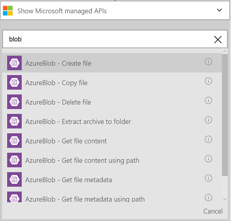
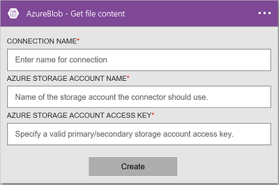
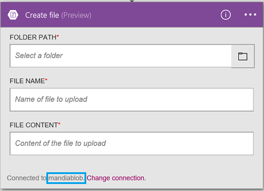

### Prerequisites
- An Azure account; you can create a [free account](https://azure.microsoft.com/free)
- An [Azure Blob Storage account](../articles/storage/storage-create-storage-account.md) including the storage account name, and its access key. This information is listed in the properties of the storage account in the Azure portal. Read more about [Azure Storage](../articles/storage/storage-introduction.md).

Before using your Azure Blob Storage account in a logic app, connect to your Azure Blob Storage account. You can do this easily within your logic app on the Azure  portal.  

Connect to your Azure Blob Storage account using the following steps:  

1. Create a logic app. In the Logic Apps designer, add a trigger, and then add an action. Select **Show Microsoft managed APIs** in the drop down list, and then enter "blob" in the search box. Select one of the actions:  

	  

2. If you haven't previously created any connections to Azure storage, you are prompted for the connection details:   

	  

3. Enter the storage account details. Properties with an asterisk are required.

	| Property | Details |
|---|---|
| Connection Name * | Enter any name for your connection. |
| Azure Storage Account Name * | Enter the storage account name. The storage account name is displayed in the storage properties in the Azure portal. |
| Azure Storage Account Access Key * | Enter the storage account key. The access keys are displayed in the storage properties in the Azure portal. |

	These credentials are used to authorize your logic app to connect, and access your data. 

4. Select **Create**.

5. Notice the connection has been created. Now, proceed with the other steps in your logic app: 

	  
