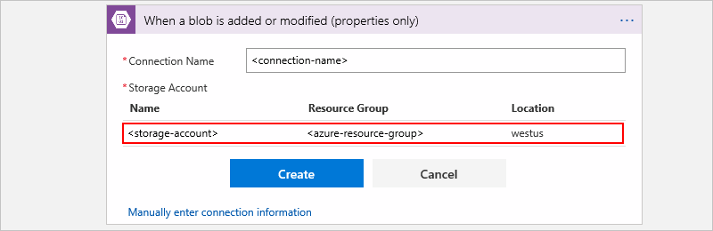

1. When you're prompted for connection information, 
provide these details:

   *Required*

   | Property | Value | Description | 
   |----------|-------|-------------| 
   | Connection Name | <*connection-name*> | The name to create for your connection | 
   | Storage Account | <*storage-account*> | Select your storage account from the list. | 
   ||| 

   For example:

     

2. When you're done, choose **Create**.

3. After you create your connection, 
continue with [Add a trigger](#add-trigger) or 
[Add an action](#add-action).

