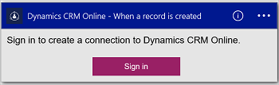
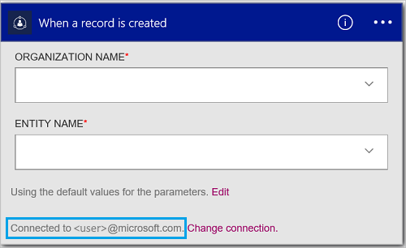

#### Prerequisites
- An Azure account; you can create a [free account](https://azure.microsoft.com/free)
- A [Dynamics CRM Online](https://www.microsoft.com/en-us/dynamics/crm-free-trial-overview.aspx) account 

Before using your Dynamics account in a logic app, authorize the logic app to connect to your CRM Online account. You can do this easily within your logic app on the Azure portal. 

Authorize your logic app to connect to your CRM Online account using the following steps:

1. Create a logic app. In the Logic Apps designer, select **Show Microsoft managed APIs** in the drop down list, and then enter "dynamics" in the search box. Select one of the triggers or actions:  
  
2. If you haven't previously created any connections to Dynamics, you are prompted to sign in using your Dynamics credentials:  
  
3. Select **Sign in**, and enter your user name and password. Select **Sign in**. 

	These credentials are used to authorize your logic app to connect to, and access the data in your Dynamics account. 
4. Notice the connection has been created. Now, proceed with the other steps in your logic app:  
  
