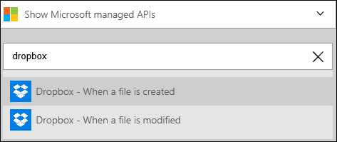
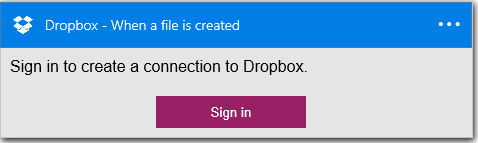
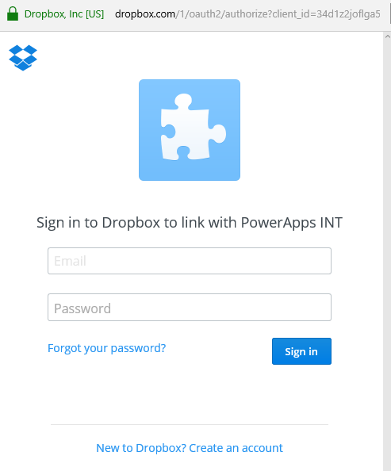
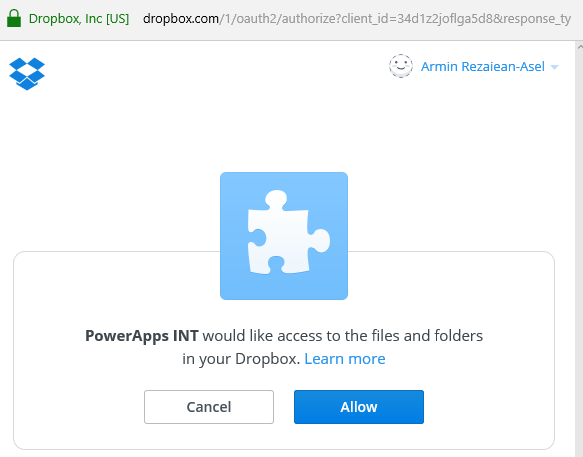
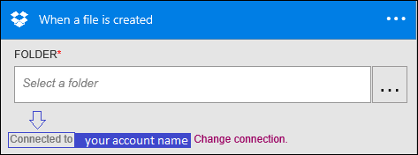

### Prerequisites
- A [Dropbox](https://www.Dropbox.com/) account 

Before you can use your Dropbox account in a Logic app, you must authorize the Logic app to connect to your Dropbox account. Fortunately, you can do this easily from within your Logic app on the Azure Portal. 

Here are the steps to authorize your Logic app to connect to your Dropbox account:

1. To create a connection to Dropbox, in the Logic app designer, select **Show Microsoft managed APIs** in the drop down list then enter *Dropbox* in the search box. Select the trigger or action you'll like to use:  
  
2. If you haven't created any connections to Dropbox before, you'll get prompted to provide your Dropbox credentials. These credentials will be used to authorize your Logic app to connect to, and access your Dropbox account's data:  
  
3. Provide your Dropbox user name and password to authorize your Logic app:  
     
4. Authorize the Logic app to use your Dropbox account:  
  
5. Notice the connection has been created and you are now free to proceed with the other steps in your Logic app:  
     
