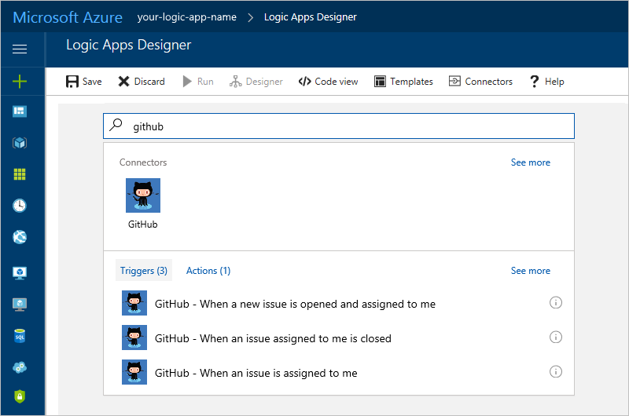
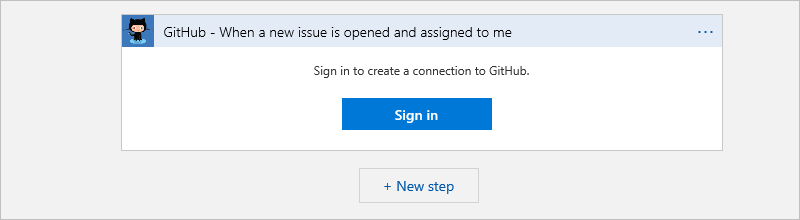
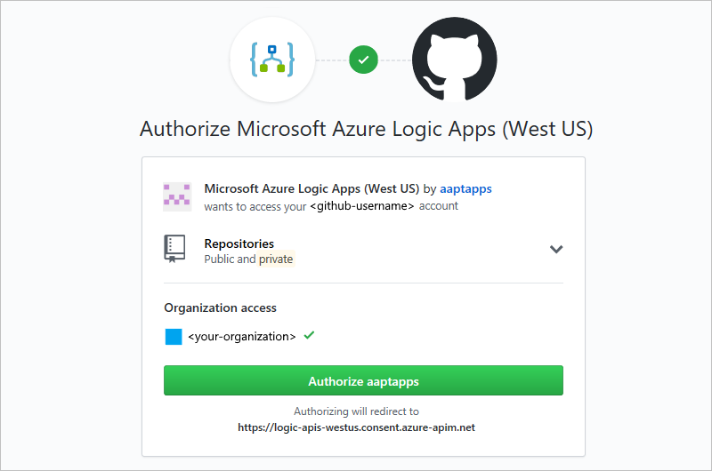
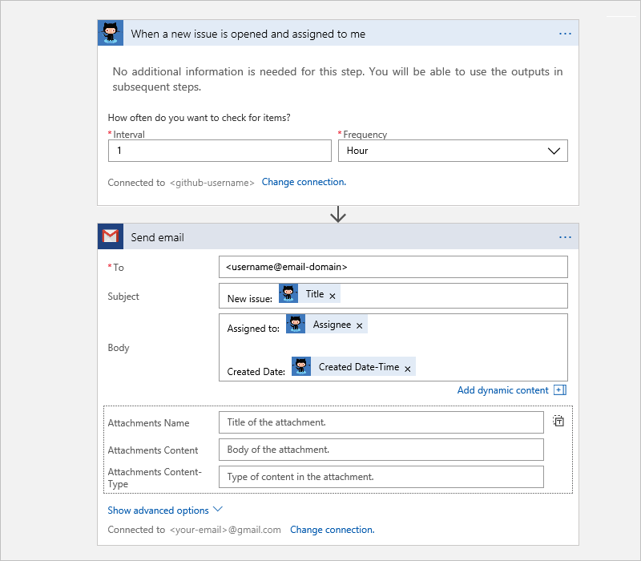

1. In the [Azure portal](https://portal.azure.com), 
create a blank logic app. 

2. In the Logic Apps Designer, 
enter "github" as your filter. 

3. Select the GitHub connector and the trigger 
that you want to use.

   

   > [!NOTE]
   > All logic app workflows must start with a trigger. 
   > You can select actions only when your logic workflow 
   > already starts with a trigger. 

4. If you didn't previously create a connection, 
choose **Sign in** so you can provide 
your GitHub credentials when prompted.  

   

   Your logic app uses these credentials to authorize 
   connecting and accessing data for your GitHub account. 

5. Provide your GitHub user name and password, then confirm your authorization.

      

   Your connection is now created in the Azure portal 
   and is ready for use.

6. Continue defining your logic app workflow.

   

