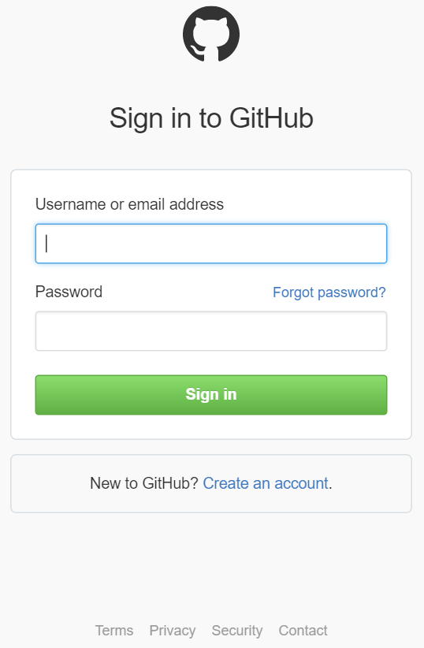
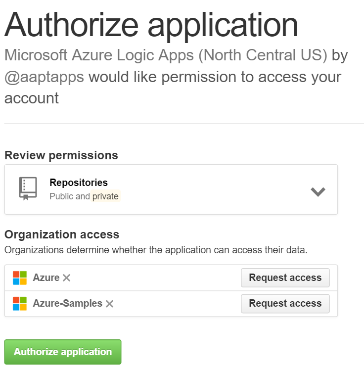
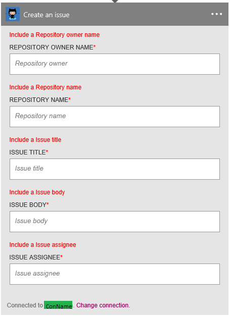

### Prerequisites
- A [GitHub](http://GitHub.com) account 

Before you can use your GitHub account in a Logic app, you must authorize the Logic app to connect to your GitHub account. Fortunately, you can do this easily from within your Logic app on the Azure Portal. 

Here are the steps to authorize your Logic app to connect to your GitHub account:

1. To create a connection to GitHub, in the Logic app designer, select **Show Microsoft managed APIs** in the drop down list then enter *GitHub* in the search box. Select the trigger or action you'll like to use:  
  
2. If you haven't created any connections to GitHub before, you'll get prompted to provide your GitHub credentials. These credentials will be used to authorize your Logic app to connect to, and access your GitHub account's data:  
  
3. Provide your GitHub user name and password to authorize your Logic app:  
     
4. Confirm your intentions:  
     
5. Notice the connection has been created in the portal. You can now proceed with creating your Logic app and using GitHub in it:   
     
