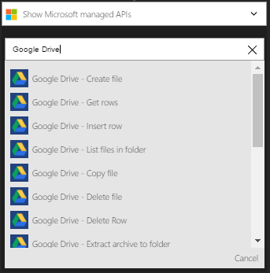
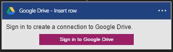
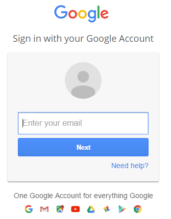
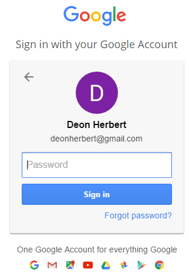
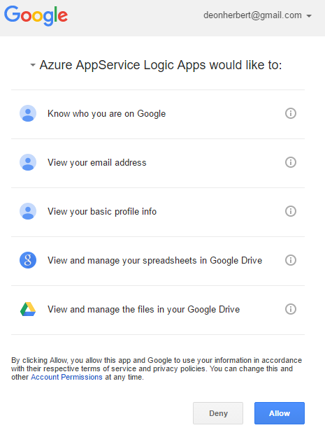
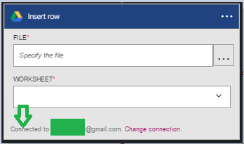

## Prerequisites

* A [Google Drive](https://www.google.com/drive/) account  

Before you can use your Google Drive account with Logic Apps, you must authorize Logic Apps to connect to your Google Drive account in the Azure portal.

Follow these steps to authorize Logic Apps to connect to your Google Drive account:  

1. Sign in to the Azure portal. 
1. Under **Azure services**, select **Logic Apps**. Then, select the name of your logic app from the list.
1. On your logic app's menu, select **Logic app designer** under **Development Tools**.
1. In the Logic Apps Designer, select **Show Microsoft managed APIs** in the drop-down list, then enter *GoogleDrive* in the search box. Select the trigger or action to use:  
     
2. If you haven't created any connections to Google Drive before, follow the prompt to provide your Google Drive credentials. These credentials are used to authorize your logic app to access your Google Drive account's data:  
     
3. Provide your Google Drive email address:  
     
4. Provide your Google Drive password to authorize your logic app:  
   
5. Allow the connection to Google Drive. 
     
6. The connection is now listed in the step. Select save, then continue creating your logic app.   
     
