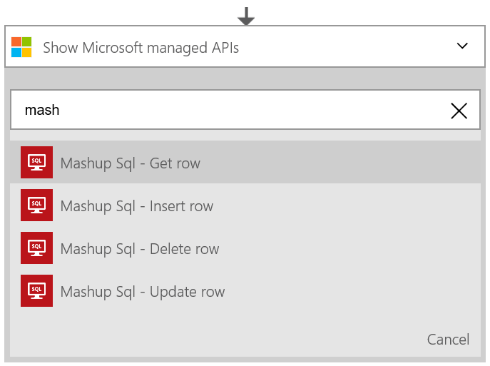
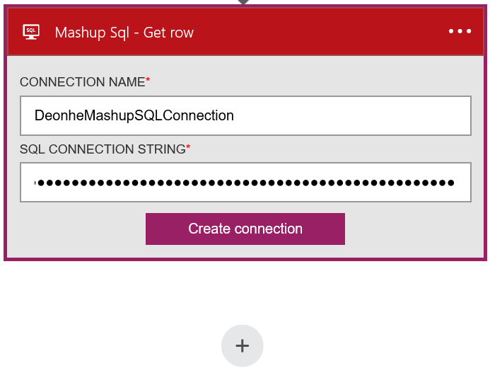
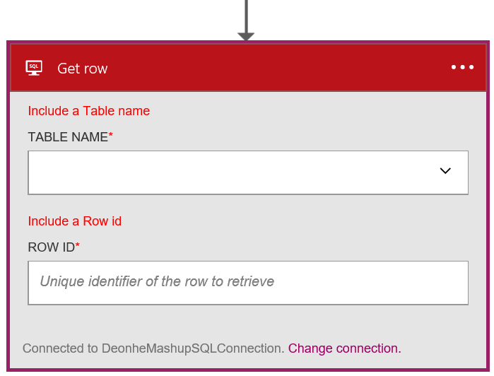

### Prerequisites
- Access to a SQL Server database

Before you can use Mashup SQL in a Logic app, you must authorize the Logic app to connect to your Mashup SQL account. Fortunately, you can do this easily from within your Logic app on the Azure Portal. 

Here are the steps to authorize your Logic app to connect to your Mashup SQL account:

1. To create a connection to Mashup SQL, in the Logic app designer, select **Show Microsoft managed APIs** in the drop down list then enter *Mashup SQL* in the search box. Select the trigger or action you'll like to use:  
  
2. If you haven't created any connections to Mashup SQL before, you'll get prompted to provide your Mashup SQL credentials. These credentials will be used to authorize your Logic app to connect to, and access your Mashup SQL account's data:  
  
5. Notice the connection has been created and you are now free to proceed with the other steps in your Logic app:  
  