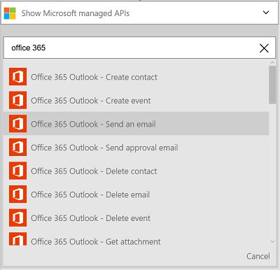
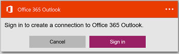
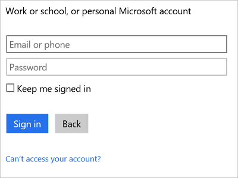
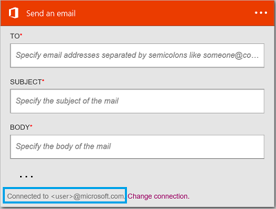

#### Prerequisites
* An Azure account; you can create a [free account](https://azure.microsoft.com/free)
* An [Office 365](https://office365.com) account  

Before using your Office 365 account in a logic app, authorize the logic app to connect to your Office 365 account. You can do this easily within your logic app on the Azure portal.  

Authorize your logic app to connect to your Office 365 account using the following steps:

1. Create a logic app. In the Logic Apps designer, select **Show Microsoft managed APIs** in the drop down list, and then enter "office 365" in the search box. Select one of the triggers or actions:  
      
2. If you haven't previously created any connections to Office 365, you are prompted to sign in using your Office 365 credentials:  
      
3. Select **Sign in**, and enter your user name and password. Select **Sign in**:  
    
   
    These credentials are used to authorize your logic app to connect to, and access your Office 365 account. 
4. Notice the connection has been created. Now, proceed with the other steps in your logic app:   
      

