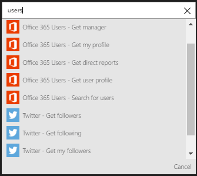
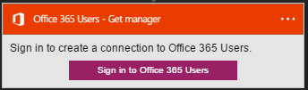
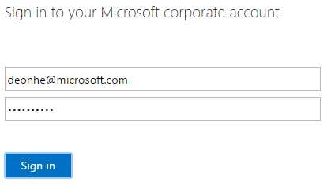
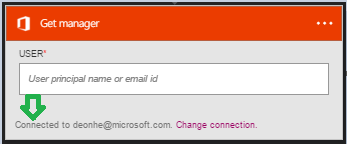

### Prerequisites
* An [Office 365 Users](https://office365.com) account  

Before you can use your Office 365 Users account in a Logic app, you must authorize the Logic app to connect to your Office 365 Users account.Fortunately, you can do this easily from within your Logic app on the Azure Portal.  

Here are the steps to authorize your Logic app to connect to your Office 365 Users account:  

1. To create a connection to Office 365 Users, in the Logic app designer, select **Show Microsoft managed APIs** in the drop down list then enter *Office 365 Users* in the search box. Select the trigger or action you'll like to use:  
     
2. If you haven't created any connections to Office 365 Users before, you'll get prompted to provide your Office 365 Users credentials. These credentials will be used to authorize your Logic app to connect to, and access your Office 365 Users account's data:  
     
3. Provide your Office 365 Users user name and password to authorize your Logic app:  
     
4. Notice the connection has been created and you are now free to proceed with the other steps in your Logic app:  
     

