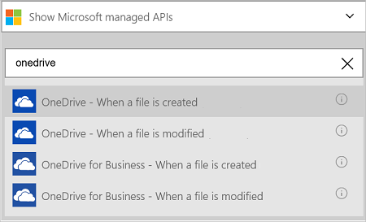
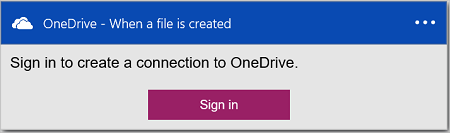
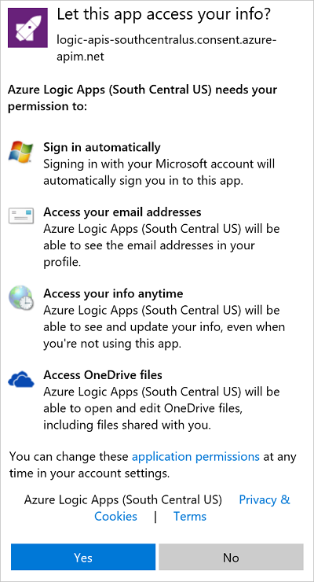
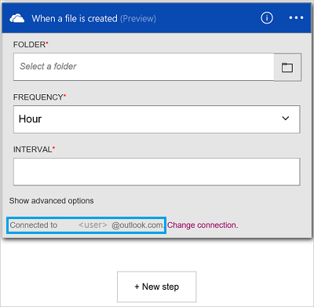

#### Prerequisites
- An Azure account; you can create a [free account](https://azure.microsoft.com/free)
- A [OneDrive](https://www.microsoft.com/store/apps/onedrive/9wzdncrfj1p3) account 

Before you can use your OneDrive account in a logic app, you must authorize the logic app to connect to your OneDrive account. Fortunately, you can do this easily from within your logic app on the Azure Portal. 

Authorize your logic app to connect to your OneDrive account using the following steps:

1. Create a logic app. In the Logic Apps designer, select **Show Microsoft managed APIs** in the drop down list, and then enter "onedrive" in the search box. Select one of the triggers or actions:  
  
2. If you haven't previously created any connections to OneDrive, you are prompted to sign in using your OneDrive credentials:  
  
3. Select **Sign in**, and enter your user name and password. Select **Sign in**:  
     

	These credentials are used to authorize your logic app to connect to, and access the data in your OneDrive account. 
4. Select **Yes** to authorize the logic app to use your OneDrive account:  
     
5. Notice the connection has been created. Now, proceed with the other steps in your logic app:  
  
