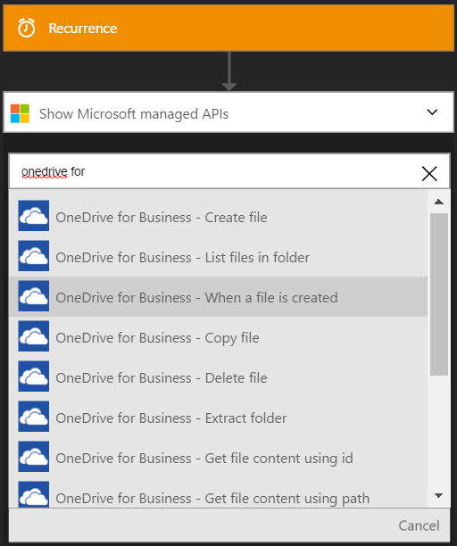
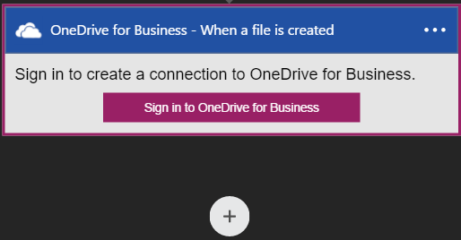
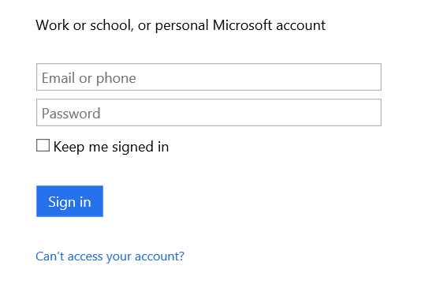
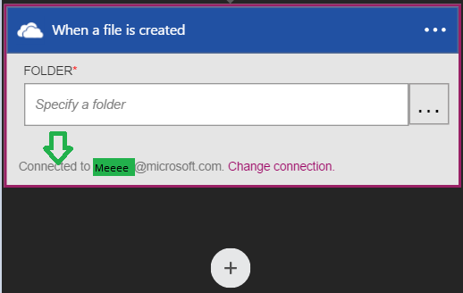

### Prerequisites
* A [OneDrive](http://OneDrive.com) account 

Before you can use your OneDrive for Business account in a Logic app, you must authorize the Logic app to connect to your OneDrive for Business account. Fortunately, you can do this easily from within your Logic app on the Azure Portal. 

Here are the steps to authorize your Logic app to connect to your OneDrive for Business account:

1. To create a connection to OneDrive for Business, in the Logic app designer, select **Show Microsoft managed APIs** in the drop down list then enter *OneDrive for Business* in the search box. Select the trigger or action you'll like to use:  
   
2. If you haven't created any connections to OneDrive for Business before, you'll get prompted to provide your OneDrive for Business credentials. These credentials will be used to authorize your Logic app to connect to, and access your OneDrive for Business account's data:  
   
3. Provide your OneDrive for Business user name and password to authorize your Logic app:  
      
4. Notice the connection has been created and you are now free to proceed with the other steps in your Logic app:  
      

