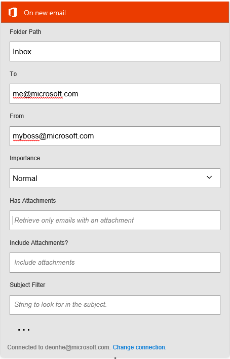
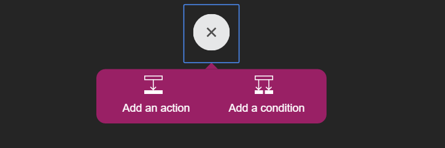
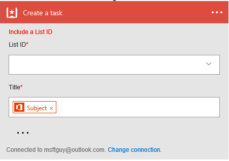

### Prerequisites
- An Outlook.com account
- A Wunderlist account  

### Connect to Outlook

[AZURE.INCLUDE [Steps to connect to Wunderlist](./connectors-create-api-wunderlist.md)]

### Configure your Outlook settings

1.  Provide the details regarding which emails you'd like to trigger your Logic app on. Here's a sample of what I did so I can trigger 
my Logic app when my boss sends me an email:  
    
Now that you've decided the criteria for which emails will trigger the Logic app, its time to decide what should be done when an email that meets you criteria arrives in your inbox. Here, I'll create a Wunderlist task, and I'll use the subject of the email as the title of the task: 
2. Select the **plus sign** below the **On new email** dialog: 
  
3. Select the **Add an action** option:  
     

### Connect to Wunderlist

[AZURE.INCLUDE [Steps to connect to Wunderlist](./connectors-create-api-wunderlist.md)]

### Configure your Wunderlist settings
1. Select the Wunderlist **List ID** where you want the task to be created
2. Since we decided to use the subject of the email as the **Title**, select subject from the outputs list for the title  
  
3. Save the Logic app *****************************TODO:****************************************************************************************

### Test the Logic app:
1. Arrange for someone to send you an email that meets the criteria you defined to trigger the logic app

*****************************TODO:****************************************************************************************

