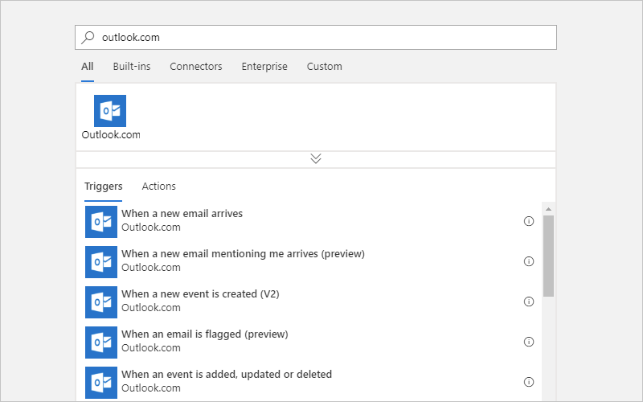
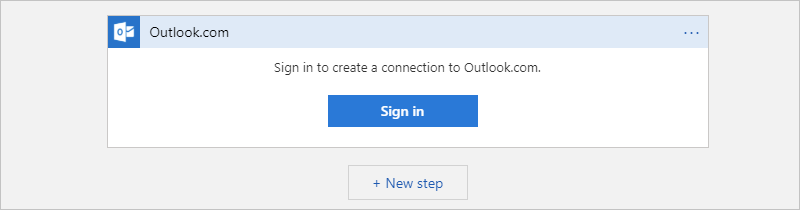

1. In the search box, enter "outlook.com" as your filter. 
For this example, select this trigger: **When a new email arrives**

   

1. After you select the trigger (or action), 
you're prompted to sign in to your Outlook.com account, 
if you already didn't sign in. Choose **Sign in**.

     

3. Select your Outlook.com account credentials.

     

   Your credentials are used for connecting and 
   accessing your Outlook.com account's data.
   You can reuse this connection with any other 
   logic app in your Azure subscription. 
