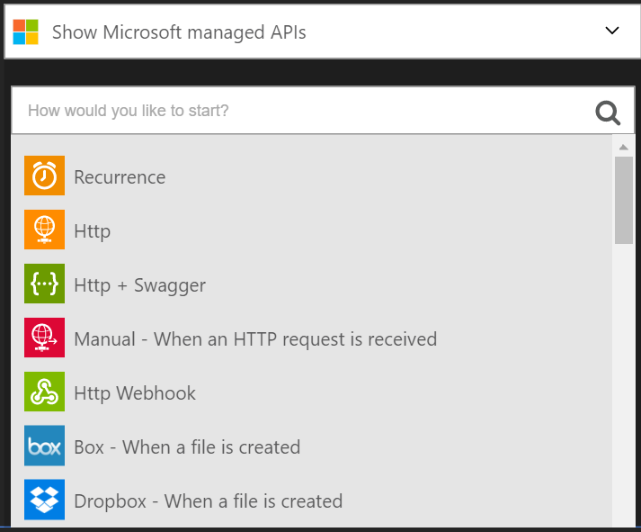
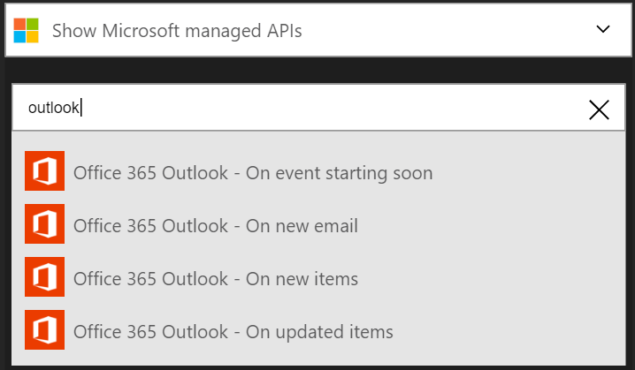
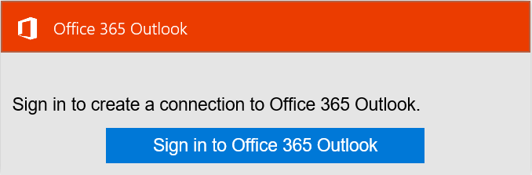
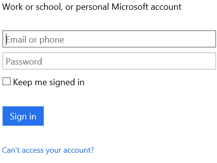

## Connect to Outlook.com

### Prerequisites
- An Outlook.com account

Before you can use your Outlook.com account in a Logic app, you must authorize the Logic app to connect to your Outlook.com account. Fortunately, you can do this easily from within your Logic app on the Azure Portal. 

Here are the steps to authorize your Logic app to connect to your Outlook.com account:

1. All Logic apps need to be started by a trigger so after you create your Logic app, the designer opens and displays a list of triggers that you can use to start your Logic app:

  
2. Enter "outlook" in the search box. Notice the list is filtered to list all the triggers with "Outlook" in the name:
  
3. Select **Office 365 Outlook - On new email**.   
  If you haven't created any connections to Outlook before, you'll get prompted to provide your Outlook.com credentials. These credentials will be used to authorize your Logic app to connect to, and access your Outlook.com account's data: 
  
4. Provide your credentials for Outlook and sign in:
    
That's it. You've now created a connection to Outlook. This connection will be available for use in any other Logic app that you create.

