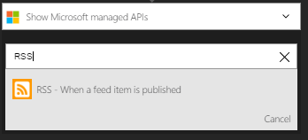
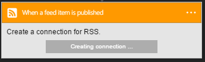
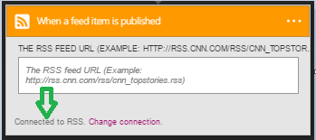

### Prerequisites

- An [RSS](https://wikipedia.org/wiki/RSS) account  

Before you can use your RSS account in a Logic app, you must authorize the Logic app to connect to your RSS account.Fortunately, you can do this easily from within your Logic app on the Azure Portal.  

Here are the steps to authorize your Logic app to connect to your RSS account:  
1. To create a connection to RSS, in the Logic app designer, select **Show Microsoft managed APIs** in the drop down list then enter *RSS* in the search box. Select the trigger or action you'll like to use:  
  
2. Select **Create connection** :  
  
3. Notice the connection has been created and you are now free to proceed with the other steps in your Logic app:  
   
