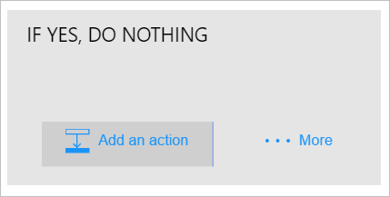
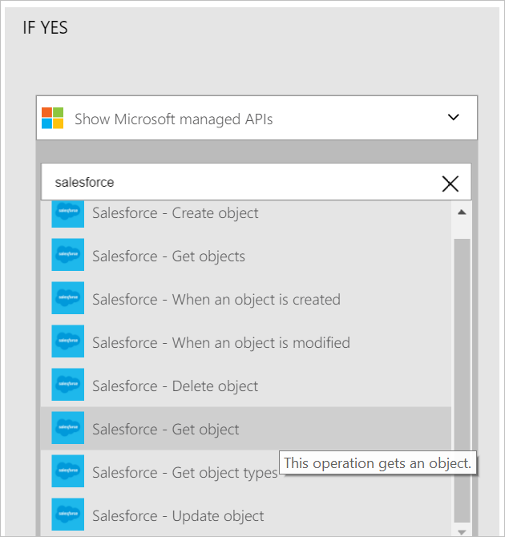
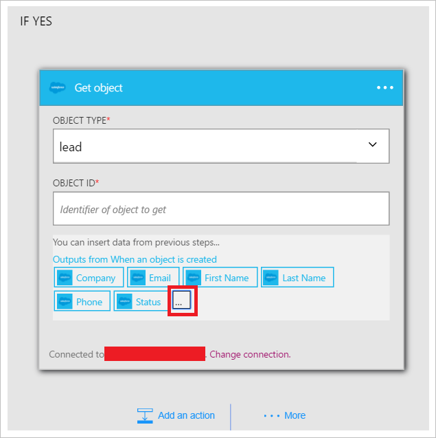
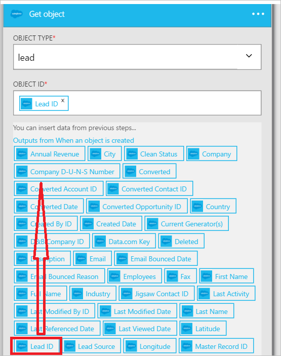
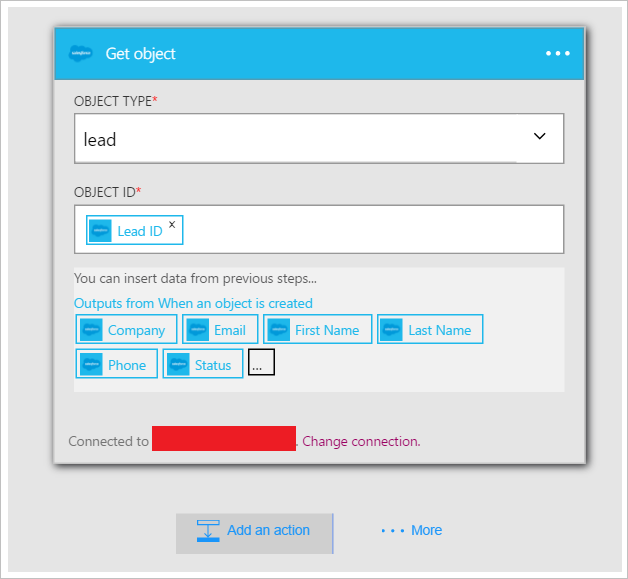
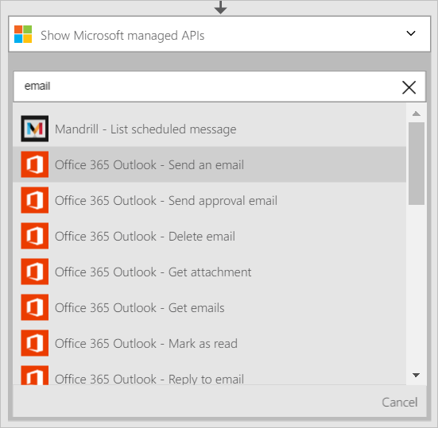
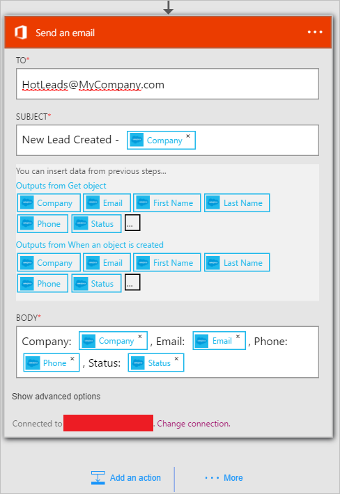
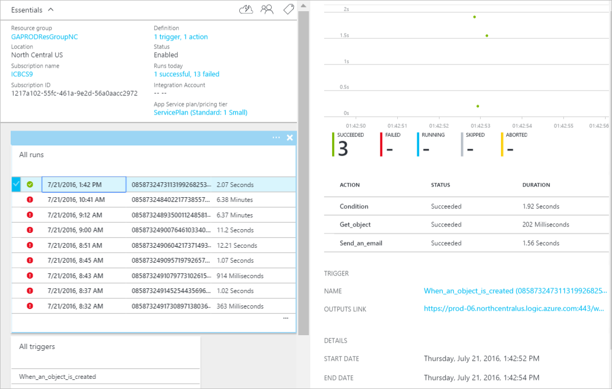

Now that you have added a condition, its time to do something interesting with the data that's generated by the trigger. Follow these steps to add the **Salesforce - Get object** action. This action will get the data each time a new lead is created. You will also add a second action that will use the data from the Salesforce - Get an object action to send an email using the Office 365 connector.  

To configure the this action, you will need to provide the following information. You will notice that it is easy to use data generated by the trigger as input for some of the properties for the new file:

|Create file property|Description|
|---|---|
|Object type|This is the type of Salesforce object you are interested in. Examples are Lead, Account, etc.|
|Object ID|This represents an identifier for the object.|

1. Select **Add an action** link. This opens the search box where you can search for any action you would like to take. For this example, Salesforce actions are of interest.      
  
- Enter *salesforce* to search for actions related to salesforce.
- Select **Salesforce - Get object** as the action to take.   **Note**: you will be prompted to authorize your logic app to access your Salesforce account if you have not done so previously.    
    
- The **Get object** control opens.  
- Select *lead* as the object type.
- Select the **Object ID** control.
- Select **...** to expand the list of tokens that can be used as input for actions.       
    
- Select **Lead ID** control opens.   
     
- Notice that the Lead ID token is now in the Object ID control, indicating that the Get object action will search for a lead with an ID that is equal to the lead ID of lead that triggered this logic app.  
  
- Save your work. That's it, you have added the Get object action to your logic app. Your Get object control should look like this:    
  

Now that you have added an action to get a lead, you may want to do something interesting with the newly created lead. In an enterprise, you may want to send an email to notify a distribution list that a new lead has been created. Let's use the Office 365 connector to send an email with some of the relevant information from the new lead object in Salesforce.  

1. Select **Add an action** then enter *email* in the search control. This filters the actions to those that are related to sending and receiving email.  
- Select the **Office 365 Outlook - Send an email** list item. If you haven't already created a *connection* to your Office 365 account, you will be prompted to enter your Office 365 credentials to create it now. After you are done, the **Send an email** control opens.        
  
- Enter the email address that you'd like to send email to in the **To** control.
-  In the **Subject** control, enter *New Lead created - * then select the *Company* token. This will display the *company* field from the new lead created in Salesforce.  
-  In the **body** control, you can select any of the tokens from the new lead object and you can also enter whatever text you would like to display in the body of the email. Here's an example:  
   
- Save your workflow.  

That's it. Your logic app is now complete.  

Now, you can test your logic app: in Salesforce, create a new lead that meets the condition you created.  If you followed this walk-through fully, just create a lead with an email address that contains *amazon.com* in it. After a few seconds your logic app should be triggered and the results may look similar to this:  
  

