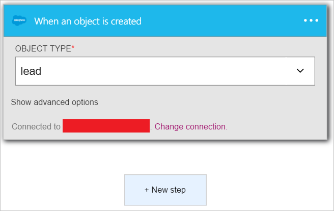
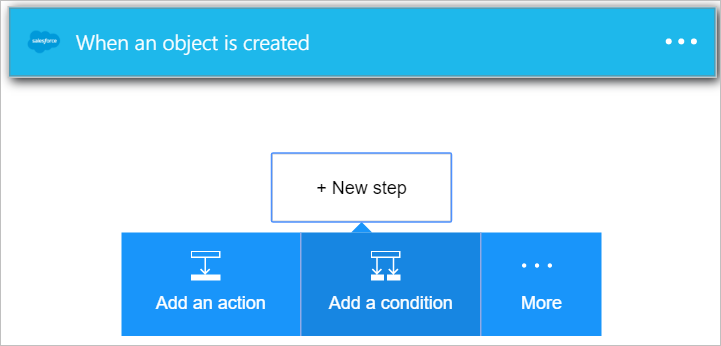
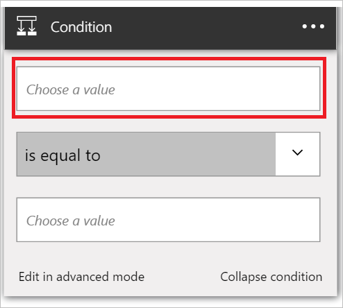
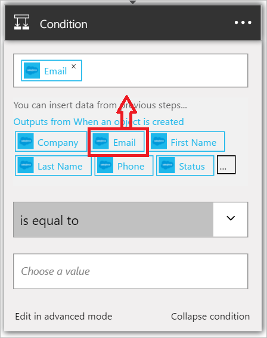
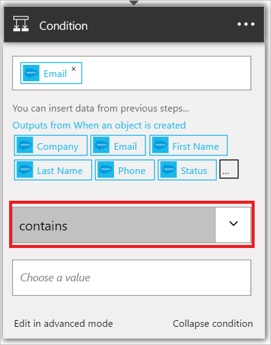
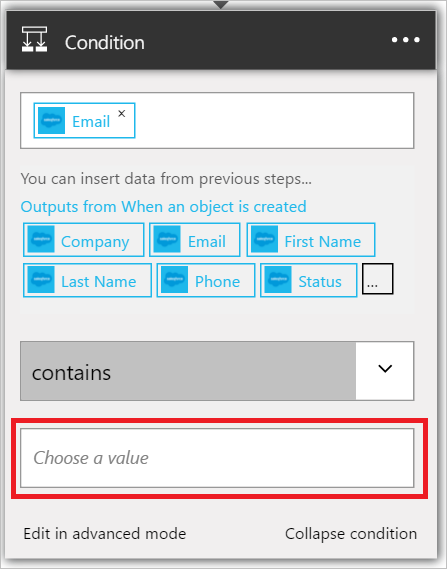
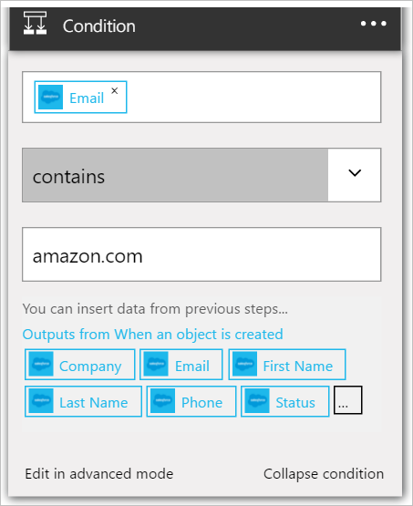

This condition will evaluate the email address field of each new Salesforce lead. If the email address contains *amazon.com*, the condition result will be *True*.

1. Select **+ New step**.  
   
- Select **Add a condition**.    
  
- Select **Choose a value**.    
  
- Select the *Email* token from the lead of the trigger.    
  
- Select *Contains*.      
  
- Select **Choose a value** at the bottom of the control.     
  
- Enter *amazon.com* as the value you would like to evaluate the email address of the new lead for. If the email address contains *amazon.com*, the condition will evaluate to *True* and the other steps in your logic app can proceed.    
  
- Save your logic apps.  

