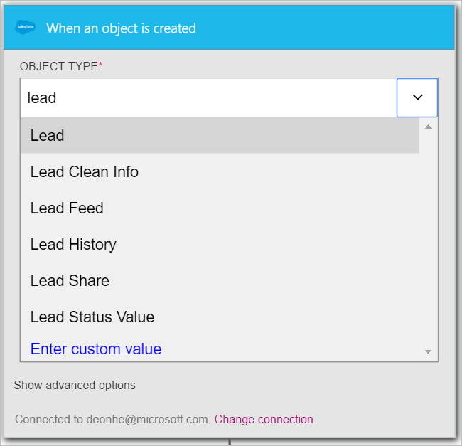

In this walk-through, you will learn how to use the **Salesforce - When an object is created** trigger to initiate a logic app workflow when a new lead is created in your Salesforce.

>[AZURE.NOTE]You will get prompted to sign into your Salesforce account if you have not already created a *connection* to Salesforce.  

1. Enter *salesforce* in the search box on the logic apps designer then select the **Salesforce - When an object is created**  trigger.  
   
- The **When an object is created** control is displayed.  
   
- Select the **Object Type** then select *Lead* from the list of objects. In this step you are indicating that you are creating a trigger that will notify your logic app whenever a new lead is created in Salesforce.   
   
- That's it. You've created the trigger. However, you need to create at least one action in order to make this a valid logic app.    
   

At this point, your logic app has been configured with a trigger that will begin a run of the other triggers and actions in the workflow when a new item is created in your Salesforce.  