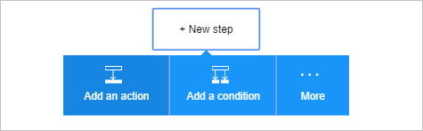
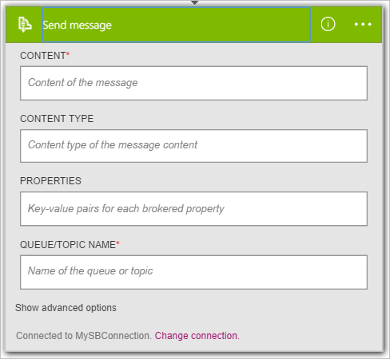
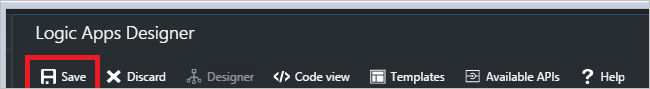

Now that you have added a trigger, its time to do something interesting with the data that's generated by the trigger. Follow these steps to add a the **Service Bus - Send message** action. This action will send a message to Service Bus.  

Follow these steps to create the send message action:  

1. Select **+ New step** to add the action.  
- Select **Add an action** link. This opens the search box where you can search for any action you would like to take. For this example, Service Bus actions are of interest.    
   
- Enter *service bus* to search for actions related to Service Bus.  
- Select **Service Bus - Send message** as the action to take. 
    
- Enter the content for the message. This is required.  
- Enter the queue or topic name to which the message will be sent. 
- Optionally, you can provide other details about the message.      
    
- Save the changes to your workflow   
     
  
  
