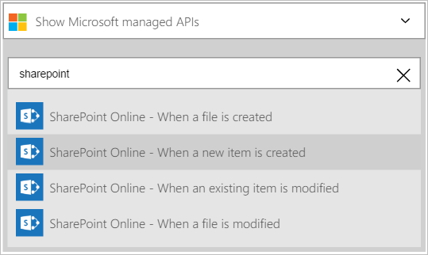
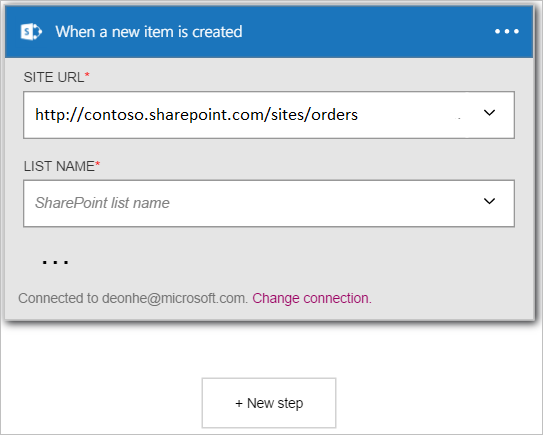
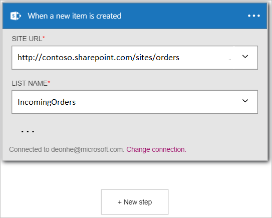

In this example, I will show you how to use the **SharePoint Online - When a new item is created** trigger to initiate a logic app workflow when a new item is created in a SharePoint Online list.

>[AZURE.NOTE]You will get prompted to sign into your SharePoint account if you have not already created a *connection* to SharePoint Online.  

1. Enter *sharepoint* in the search box on the logic apps designer then select the **SharePoint Online - When a new item is created**  trigger.  
  
- The **When a new item is created** control is displayed.  
   
- Select a **Site URL**. This is the SharePoint online site you want to monitor for new items to trigger your workflow.  
   
- Select a **List name**. This is the list on the SharePoint Online site you want to monitor for new items to trigger your workflow.  
   

At this point, your logic app has been configured with a trigger that will begin a run of the other triggers and actions in the workflow when a new item is created in SharePoint Online list you selected.  