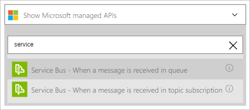
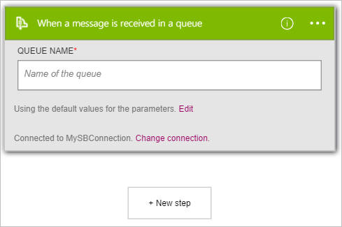
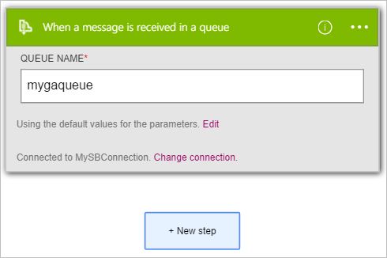

Here's how to use the **Service Bus - When a message is received in a queue** trigger to initiate a logic app workflow when a new item is sent to a Service Bus queue.  

>[AZURE.NOTE]You will be prompted to sign in with your Service Bus connection string if you have not already created a connection to Service Bus.  

1. In the search box on the logic apps designer, enter *service bus*. Then select the **Service Bus - When a message is received in a queue** trigger.  
   
- The **When a message is received in a queue** dialog box is displayed.  
   
- Enter the name of the Service Bus queue you would like the trigger to monitor.   
   

At this point, your logic app has been configured with a trigger. When a new item is received in the queue you selected, the trigger will begin a run of the other triggers and actions in the workflow.    
