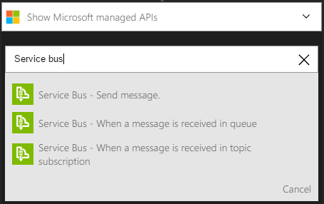
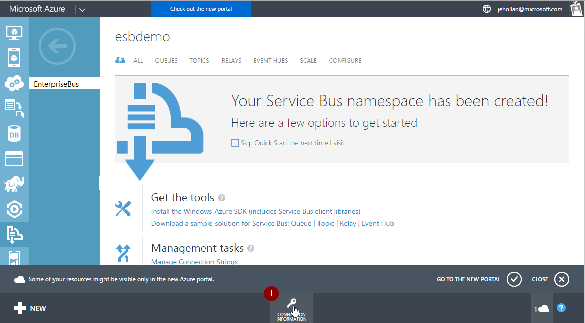
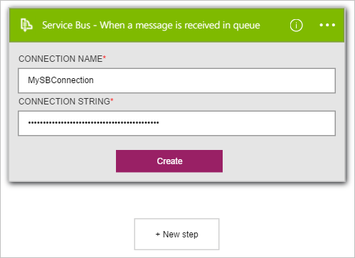
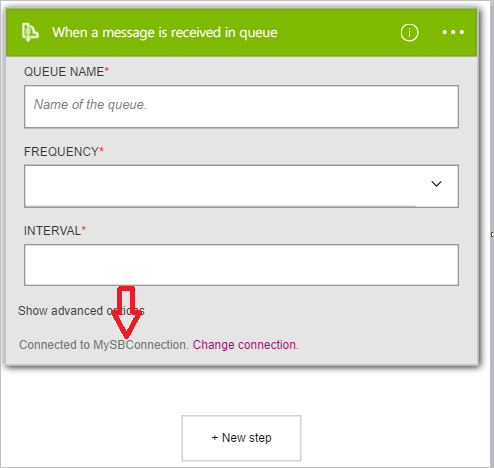

### Prerequisites

- A [ServiceBus](https://azure.microsoft.com/services/service-bus/) account  

Before you can use your Azure Service Bus account in a logic app, you must authorize the logic app to connect to your service bus account. Fortunately, you can do this easily from within your logic app on the Azure Portal.  

Here are the steps to authorize your logic app to connect to your service bus account:  
1. To create a connection to service bus, in the logic app designer, select **Show Microsoft managed APIs** in the drop down list then enter *service bus* in the search box.Select the trigger or action you'll like to use:  

      
    
2. If you haven't created any connections to service bus before, you'll get prompted to provide your service bus credentials. These credentials will be used to authorize your logic app to connect to, and access your service bus account's data.  The service bus connector needs the connection string for the service bus namespace - and it also requires **Manage** permissions.  A good way to know if your connection string is for the namespace or a specific entity is if it contains the `EntityPath` parameter, it is not the right connection string for a logic app.

    

1. Once you have received the connection string for the namespace, you can use it for the API Connection in Logic Apps.

      

3. Notice the connection has been created and you are now free to proceed with the other steps in your logic app:  
    
