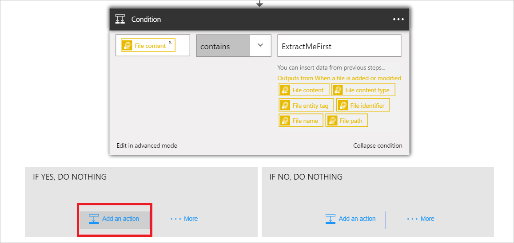
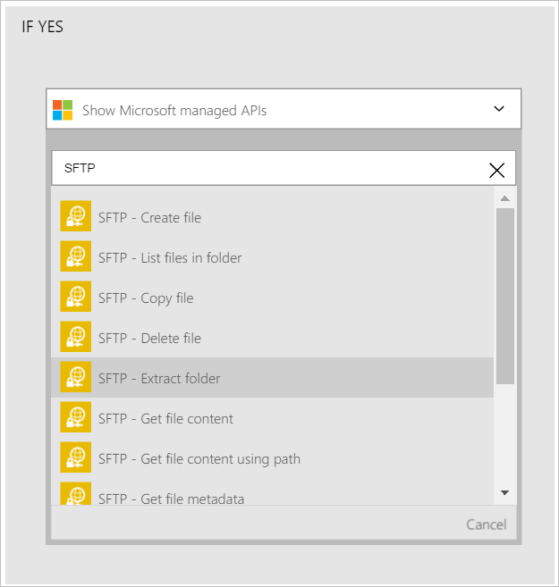
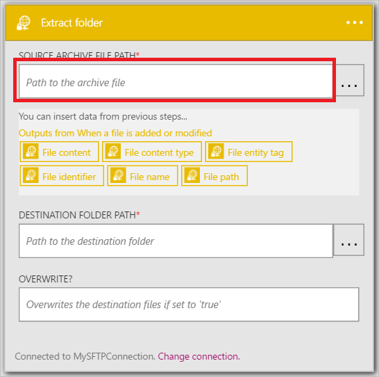
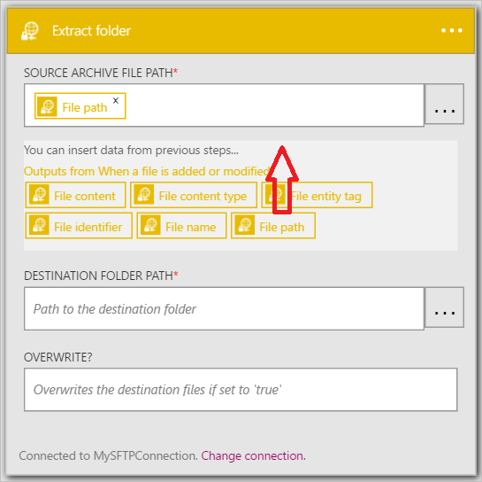
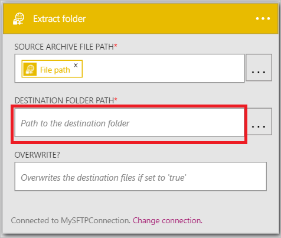
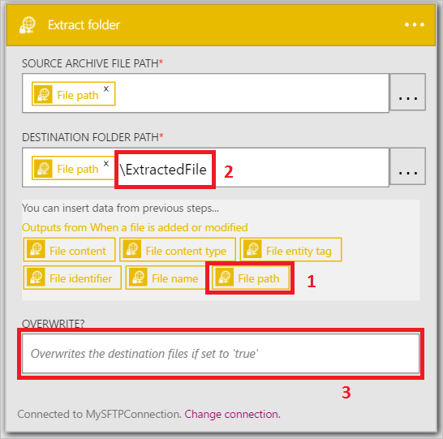
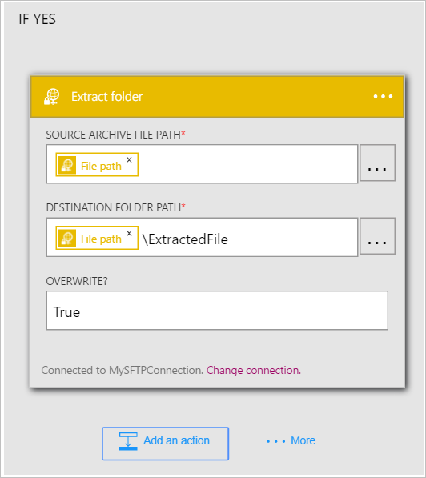

Now that you have added a trigger, its time to do something interesting with the data that's generated by the trigger. Follow these steps to add a the **SharePoint Online - Create file** action. This action will create a file in SharePoint Online each time the new item trigger fires. 

To configure the this action, you will need to provide the following information. You will notice that it is easy to use data generated  by the trigger as input for some of the properties for the new file:

|Create file property|Description|
|---|---|
|Site URL|This is the URL of the SharePoint Online site where you want to create the new file. Select the site from the list presented.|
|Folder path|This is the folder (at the Site URL) where the new file will be placed. Browse for and select the folder.|
|File name|This is the name of the file being created.|
|File content|The content that will be written to the file.|

1. Select **Add an action**.        
   
- Select **SFTP - Extract folder**      
   
- Select **Source archive file path**              
   
- Select **File path**           
   
- Select **Destination folder path**           
   
- Select the **File path** property. 
- Enter *\ExtractedFile* in the **Destination folder path** control       
   
- Enter *True* in the **Overwrite?* control      
   
- Save the changes to your workflow  
