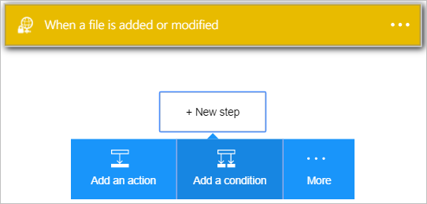
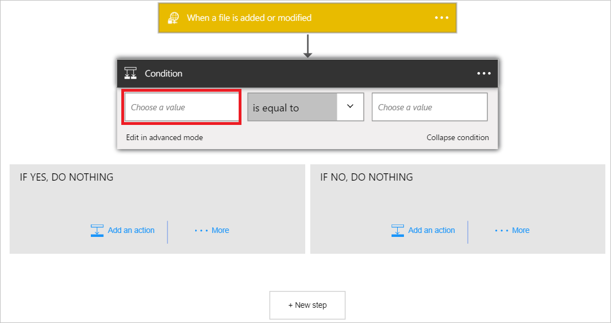
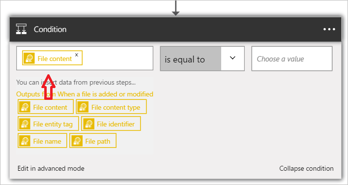
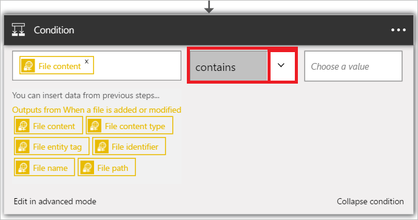
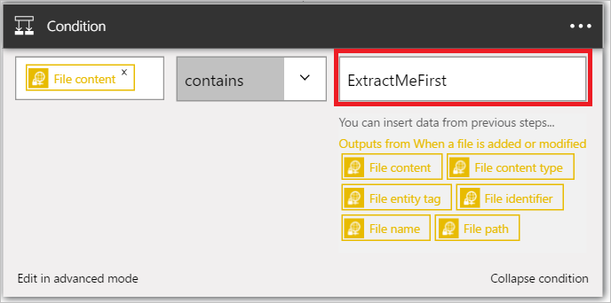

1. Select **+ New step** to add the action.  
- Select the **Add an action** link. This opens the search box where you can search for any action you would like to take. For this example, SharePoint actions are of interest.    
    
- Select **Choose a value** on the left. 
    
- Select **File content** to indicate that you want to evaluate the file contents in the condition.      
   
- Select *contains* from the list of operators.       
   
- Select **Choose a value** on the right and enter *ExtractMeFirst*. In this example, ExtractMeFirst is a value that is expected to be in a file by persons who have access to the SFTP folder to indicate that it is an archive file that should be extracted.  
   