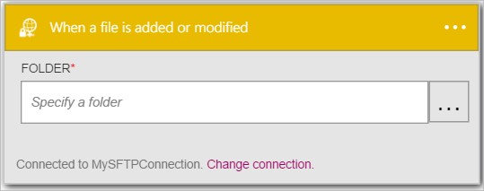
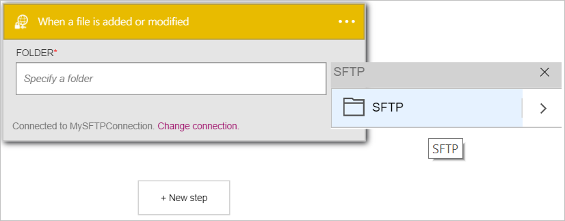
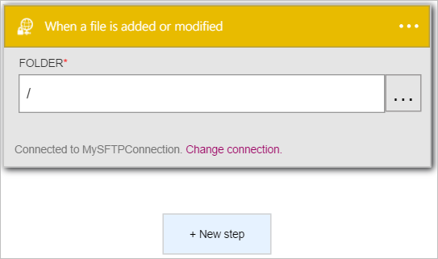

Let's add a trigger.

1. Enter *sftp* in the search box on the logic apps designer then select the **SFTP - When a file is added or modified**  trigger   
  
- The **When a file is added or modified** control opens up  
  
- Select the **...** located on the right side of the control. This opens the folder picker control  
  
- Select the **SFTP** to select the root folder as the folder to monitor for new or modified files. Notice the root folder is now displayed in the **Folder** control.  
   

At this point, your logic app has been configured with a trigger that will begin a run of the other triggers and actions in the workflow when a file is either modified or created in the specific SFTP folder. 

>[AZURE.NOTE]For a logic app to be functional, it must contain at least one trigger and one action. Follow the steps in the next section to add an action.  