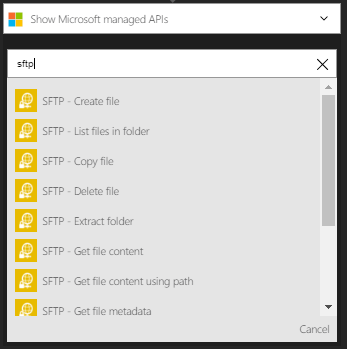
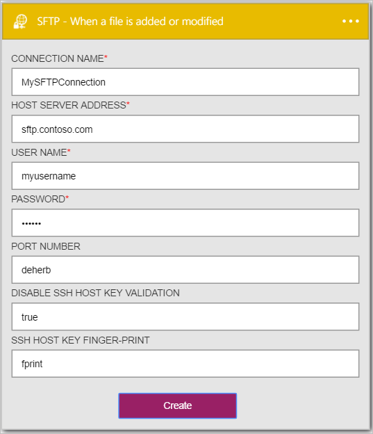
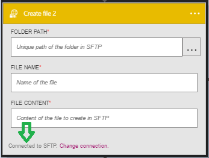

### Prerequisites

- An [SFTP](https://en.wikipedia.org/wiki/SSH_File_Transfer_Protocol) account  

Before you can use your SFTP account in a Logic app, you must authorize the Logic app to connect to your SFTP account.Fortunately, you can do this easily from within your Logic app on the Azure Portal.  

Here are the steps to authorize your Logic app to connect to your SFTP account:  
1. To create a connection to SFTP, in the Logic app designer, select **Show Microsoft managed APIs** in the drop down list then enter *SFTP* in the search box. Select the **SFTP - When a file is added or modified** trigger:  
  
2. If you haven't created any connections to SFTP before, you'll get prompted to provide your SFTP credentials. These credentials will be used to authorize your Logic app to connect to, and access your SFTP account's data:  
  
3. Notice the connection has been created and you are now free to proceed with the other steps in your Logic app:   
  
