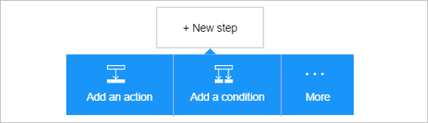
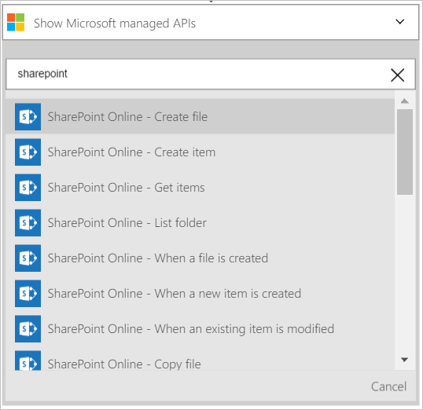
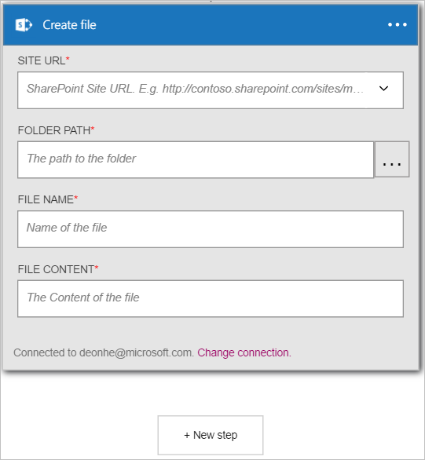
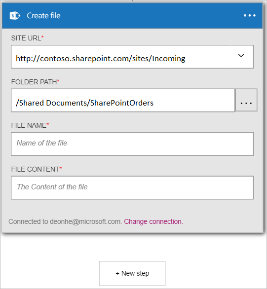
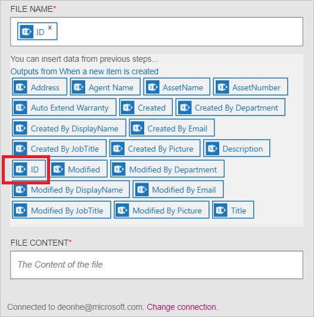
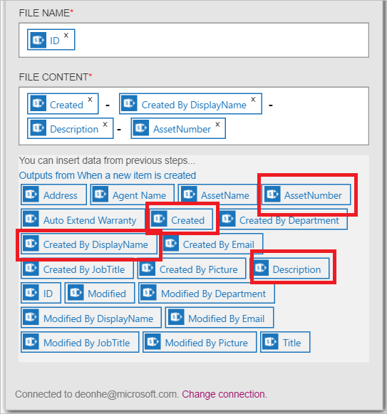

Now that you have added a trigger, its time to do something interesting with the data that's generated by the trigger. Follow these steps to add the **SharePoint Online - Create file** action. This action will create a file in SharePoint Online each time the new item trigger fires. 

To configure the this action, you will need to provide the following information. As you provide this information, you will notice that it is easy to use data generated by the trigger as input for some of the properties for the new file:

|Create file property|Description|
|---|---|
|Site URL|This is the URL of the SharePoint Online site where you want to create the new file. Select the site from the list presented.|
|Folder path|This is the folder (at the Site URL selected in the previous step) where the new file will be placed. Browse for and select the folder.|
|File name|This is the name of the file being created.|
|File content|The content that will be written to the file.|

1. Select **+ New step** to add the action.  
  
- Select the **Add an action** link. This opens the search box where you can search for any action you would like to take. For this example, SharePoint actions are of interest.    
    
- Enter *sharepoint* to search for actions related to SharePoint.
- Select **SharePoint Online - Create file** as the action to take.   **Note**: you will be prompted to authorize your Logic app to access your SharePoint account if you have not created a connection to SharePoint Online previously.    
    
- The **Create file** control opens.   
     
- Select **Site URL** and browse to find the site where you would like to create the file.     
  
- Select **Folder path** and browse to find the folder where the new file will be placed.  
  
- Select the **File name** control and enter the name of the file you want to create. Here, you can either enter the file name directly or you can use any of the properties from the trigger you created previously. You do this by selecting properties from the list of **Outputs from When a new item is created**. This list is only display after you select the **File name** control. In this walkthough, I selected ID (the ID of the new list item) as the name of the file being created by the **SharePoint Online - Create file** action.    
  
- Select the **File content** control and enter the content that will be written to the file that will be created. For the file content, notice that you can use any of the properties from the trigger you created previously. Simply select the properties from the list presented. Alternatively, you can enter the **File content** text directly into the control. In this example, I selected some properties and added spaces and a hyphen between each property.        
  
- Save the changes to your workflow  
- Congratulations, you now have a fully functional Logic app that is triggered when a new item is added to a SharePoint Online list. The app will then create a file, using some of the properties from the new list item.  You can now test it by creating a new item in the SharePoint list. 
