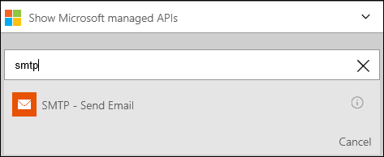
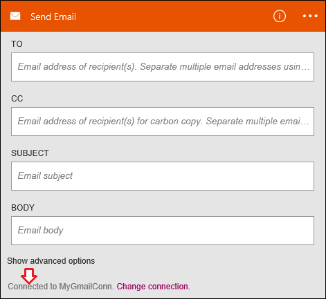

### Prerequisites

- A [SMTP](https://wikipedia.org/wiki/Simple_Mail_Transfer_Protocol) account  

Before you can use your SMTP account in a logic app, you must authorize the logic app to connect to your SMTP account.Fortunately, you can do this easily from within your logic app on the Azure Portal.  

Here are the steps to authorize your logic app to connect to your SMTP account:  
1. To create a connection to SMTP, in the logic app designer, select **Show Microsoft managed APIs** in the drop down list then enter *SMTP* in the search box. Select the trigger or action you'll like to use:  
  
2. If you haven't created any connections to SMTP before, you'll get prompted to provide your SMTP credentials. These credentials will be used to authorize your logic app to connect to, and access your SMTP account's data:  
  
3. Notice the connection has been created and you are now free to proceed with the other steps in your logic app:  
   

