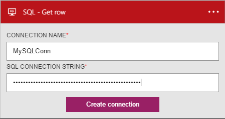
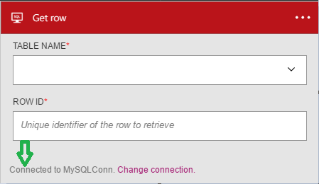

### Prerequisites

- A [SQL Azure](https://www.microsoft.com/sql) account  

Before you can use your SQL Azure account in a logic app, you must authorize the logic app to connect to your SQL Azure account.Fortunately, you can do this easily from within your logic app on the Azure Portal.  

Here are the steps to authorize your logic app to connect to your SQL Azure account:  
1. To create a connection to SQL Azure, in the logic app designer, select **Show Microsoft managed APIs** in the drop down list then enter *SQL Azure* in the search box. Select the trigger or action you'll like to use:  
  
2. If you haven't created any connections to SQL Azure before, you'll get prompted to provide your SQL Azure credentials. These credentials will be used to authorize your logic app to connect to, and access your SQL Azure account's data. The SQL Connection String format is as follows: **Server=tcp:[serverName].database.windows.net;Database=myDataBase;
User ID=[LoginForDb]@[serverName];Password=myPassword;Trusted_Connection=False;
Encrypt=True;**
  
3. Notice the connection has been created and you are now free to proceed with the other steps in your logic app:  
  
