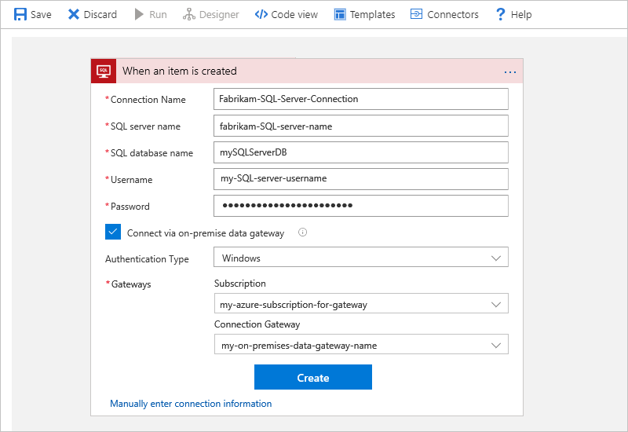

* If you're using Azure SQL Database, follow the steps under [Connect to Azure SQL Database](#connect-azure-sql-db).

* If you're using SQL Server, follow the steps under [Connect to SQL Server](#connect-sql-server).

### Connect to Azure SQL Database

When the SQL trigger or action prompts you for connection information, follow these steps, which work for both triggers and actions.

1. For **Connection Name**, create a name for your connection.

1. Under **SQL Server Name**, select your Azure SQL server. When the **SQL Database Name** list appears, select your database. Provide the user name and password for your Azure SQL server.

   You can also find this information either in the Azure portal under your SQL database properties or in your connection string:

   * `User ID=<your-user-name>`
   * `Password=<your-password>`

   

1. When you're done, select **Create**.

1. After you create your connection, continue with [Add a SQL trigger](#add-sql-trigger) or [Add a SQL action](#add-sql-action).

### Connect to SQL Server

When the SQL trigger or action prompts you for connection information, follow these steps, which work for both triggers and actions. However, before you start, make sure that you've already [set up your on-premises data gateway](https://docs.microsoft.com/azure/logic-apps/logic-apps-gateway-connection). Otherwise, your gateway won't appear in the gateways list when you create your connection.

1. For **Connection Name**, create a name for your connection.

1. In the trigger or action, select **Connect via on-premises data gateway** so that the SQL server options appear.

1. For **SQL server Name** and **SQL database name**, provide the address for your SQL server and name for your database. For **Username** and **Password**, provide the user name and password for your server.

   You can also find this information in your connection string:

   * `Server=<your-server-address>`
   * `Database=<your-database-name>`
   * `User ID=<your-user-name>`
   * `Password=<your-password>`

   

1. If your SQL server uses Windows or Basic authentication, select the **Authentication Type**.

1. Under **Gateways**, select the Azure subscription that's associated with your previously created on-premises data gateway, and select the name for your on-premises data gateway.

   If your gateway doesn't appear in the list, check that you correctly [set up your gateway](https://docs.microsoft.com/azure/logic-apps/logic-apps-gateway-connection).

   

1. When you're done, select **Create**.

1. After you create your connection, continue with 
[Add SQL trigger](#add-sql-trigger) or [Add SQL action](#add-sql-action).
