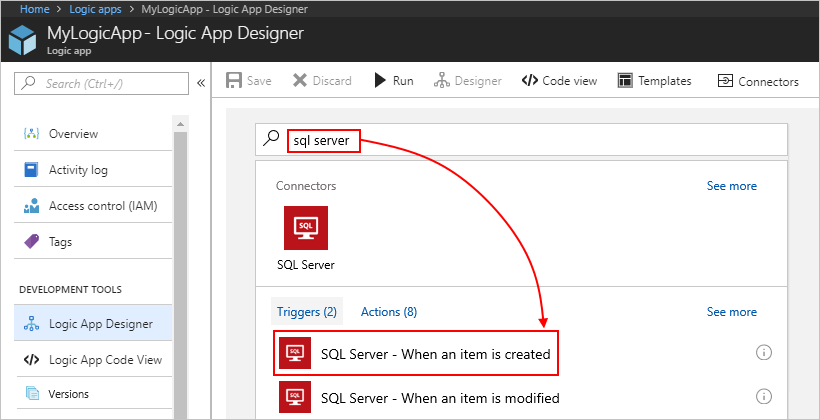
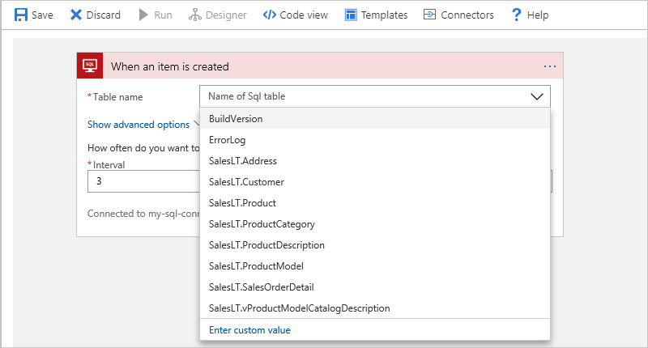

1. In the Azure portal or Visual Studio, 
open your logic app in the Logic Apps Designer. 

   This example uses the Azure portal.

2. In the search box, enter "sql server" as your filter. 
When the SQL Server connector appears, 
select either the trigger or action that you want to use. 

   This example uses a trigger. The connector works 
   for both SQL Server and Azure SQL Database.

   

3. If you didn't create any SQL connections already, 
   you're prompted to create the connection. 
   
   The asterisks (*) identify required values. 

   *Azure SQL Database*
    
   Select your SQL server, and then select your database.

    

   *SQL Server* 
    
   To get the SQL Server options, 
   select **Connect via on-premise data gateway**. 

   Before you can select a gateway, you must first 
   [set up data gateway](https://docs.microsoft.com/azure/logic-apps/logic-apps-gateway-connection).

   

   | Property | Required | Value | Details | 
   |----------|----------|-------|---------| 
   | Connection Name | Yes | <*my-sql-connection*> | Create a name for your connection. |
   | SQL Server Name | Yes | <*my-sql-server*> | The name for your SQL server 
For Azure SQL Database, select your server name from the list. 
For SQL Server, this name appears here in the connection string:  "Server=<*yourServerAddress*>" |
   | SQL Database Name | Yes | <*my-sql-database*>  | The name for your SQL database 
For Azure SQL Database, select your database from the list, which appears only after you select your server. 
For SQL Server, this name appears here in the connection string:  "Database=<*yourDatabaseName*>" |
   | Username | Yes | <*my-sql-username*> | The username for accessing your database 
For Azure SQL Database, this name appears in the Azure portal under the SQL database properties. 
For SQL Server, this name appears here in the connection string:  "UserId=<*yourUserName*>" |
   | Password | Yes | <*my-sql-password*> | The password for accessing your database  
For Azure SQL Database, this name appears in the Azure portal under the SQL database properties. 
For SQL Server, this name appears here in the connection string:  "Password=<*yourPassword*>" | 
   | Connect via on-premise gateway | Only for on-premises SQL Server | | Select this option when connecting to SQL Server. | 
   | Authentication Type | No | Windows | Select the authentication type used by your SQL server. | 
   | Gateways | Only for on-premises SQL Server | <*my-data-gateway*> | Select your on-premises data gateway. If your gateway doesn't appear in the list, check that you correctly [set up your gateway](https://docs.microsoft.com/azure/logic-apps/logic-apps-gateway-connection). | 
   ||||| 

4. When you're done, choose **Create**. 

After you create your connection, continue with the 
other steps in your logic app. For example, you can now 
select the table that you want your logic app to check:

