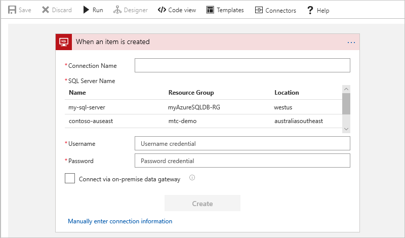
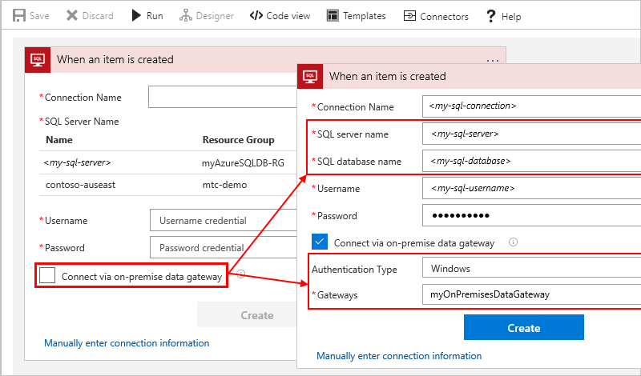

* If you're using Azure SQL Database, follow the steps under 
[Connect to Azure SQL Database](#connect-azure-sql-db). 

* If you're using SQL Server, follow the steps under 
[Connect to SQL Server](#connect-sql-server).

### Connect to Azure SQL Database

1. When the SQL trigger or action prompts you for connection information, 
follow these steps:

   1. Create a name for your connection.

   2. Select your SQL server, and then select your database. 

      The database list appears only after you select your SQL server.
 
   3. Provide your user name and password for your server.

      You can find this information either in the Azure portal 
      under your SQL database properties or in your connection string: 
      
      "User ID=<*yourUserName*>"
       
      "Password=<*yourPassword*>"

   This example shows the connection information for a trigger, 
   but these steps work for actions too.

   
    
   Asterisks (*) indicate required values.

   | Property | Value | Details | 
   |----------|-------|---------| 
   | Connection Name | <*my-sql-connection*> | The name for your connection | 
   | SQL Server Name | <*my-sql-server*> | The name for your SQL server |
   | SQL Database Name | <*my-sql-database*>  | The name for your SQL database | 
   | Username | <*my-sql-username*> | The user name for accessing your database |
   | Password | <*my-sql-password*> | The password for accessing your database | 
   |||| 

2. When you're done, choose **Create**.

3. After you create your connection, continue with 
[Add SQL trigger](#add-sql-trigger) or [Add SQL action](#add-sql-action).

### Connect to SQL Server

Before you can select your gateway, make sure that you already 
[set up your data gateway](https://docs.microsoft.com/azure/logic-apps/logic-apps-gateway-connection). 
That way, your gateway appears in the gateways list when you create your connection.

1. When the SQL trigger or action prompts you for connection information, 
follow these steps:

   1. In the trigger or action, select **Connect via on-premises data gateway** 
   so that the SQL server options appear.

   2. Create a name for your connection.

   3. Provide the address for your SQL server, then provide the name for your database.
   
      You can find this information in your connection string: 
      
      * "Server=<*yourServerAddress*>"
      * "Database=<*yourDatabaseName*>"

   4. Provide your user name and password for your server.

      You can find this information in your connection string: 
      
      * "User ID=<*yourUserName*>"
      * "Password=<*yourPassword*>"

   5. If your SQL server uses Windows or Basic authentication, select the authentication type.

   6. Select the name for your on-premises data gateway that you previously created.
   
      If your gateway doesn't appear in the list, check that you correctly 
      [set up your gateway](https://docs.microsoft.com/azure/logic-apps/logic-apps-gateway-connection).

   This example shows the connection information for a trigger, 
   but these steps work for actions too.

   
    
   Asterisks (*) indicate required values.

   | Property | Value | Details | 
   |----------|-------|---------| 
   | Connect via on-premises gateway | Select this option first for SQL Server settings. | | 
   | Connection Name | <*my-sql-connection*> | The name for your connection | 
   | SQL Server Name | <*my-sql-server*> | The name for your SQL server |
   | SQL Database Name | <*my-sql-database*>  | The name for your SQL database |
   | Username | <*my-sql-username*> | The user name for accessing your database |
   | Password | <*my-sql-password*> | The password for accessing your database | 
   | Authentication Type | Windows or Basic | Optional: The authentication type used by your SQL server | 
   | Gateways | <*my-data-gateway*> | The name for your on-premises data gateway | 
   |||| 

2. When you're done, choose **Create**. 

3. After you create your connection, continue with 
[Add SQL trigger](#add-sql-trigger) or [Add SQL action](#add-sql-action).
