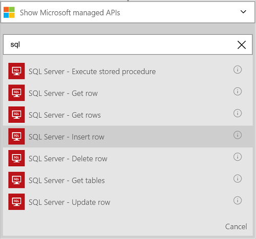
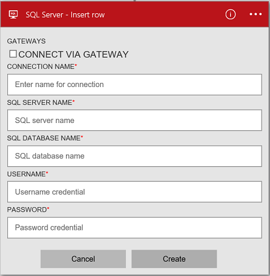
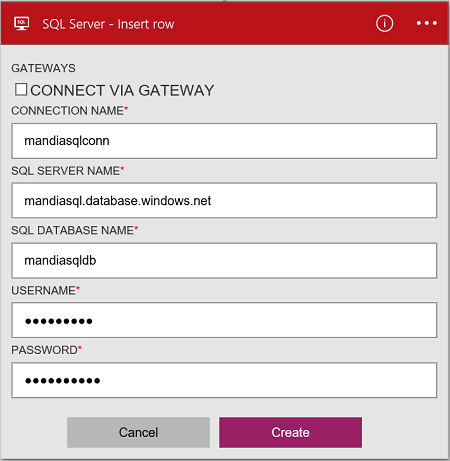
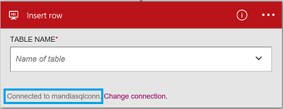

### Prerequisites
- An Azure account; you can create a [free account](https://azure.microsoft.com/free)
- An [Azure SQL Database](../articles/sql-database/sql-database-get-started.md) with its connection information, including the server name, database name, and username/password. This information is included in the SQL Database connection string:
  
	Server=tcp:*yoursqlservername*.database.windows.net,1433;Initial Catalog=*yourqldbname*;Persist Security Info=False;User ID={your_username};Password={your_password};MultipleActiveResultSets=False;Encrypt=True;TrustServerCertificate=False;Connection Timeout=30;

	Read more about [Azure SQL Databases](https://azure.microsoft.com/services/sql-database).

> [AZURE.NOTE] When you create an Azure SQL Database, you can also create the sample databases included with SQL. 

Before using your Azure SQL Database in a logic app, connect to your SQL Database. You can do this easily within your logic app on the Azure portal.  

Connect to your Azure SQL Database using the following steps:  

1. Create a logic app. In the Logic Apps designer, add a trigger, and then add an action. Select **Show Microsoft managed APIs** in the drop down list, and then enter "sql" in the search box. Select one of the actions:  

	

2. If you haven't previously created any connections to SQL Database, you are prompted for the connection details:  

	 

3. Enter the SQL Database details. Properties with an asterisk are required.

	| Property | Details |
|---|---|
| Connect via Gateway | Leave this unchecked. This is used when connecting to an on-premises SQL Server. |
| Connection Name * | Enter any name for your connection. | 
| SQL Server Name * | Enter the server name; which is something like *servername.database.windows.net*. The server name is displayed in the SQL Database properties in the Azure portal, and also displayed in the connection string. | 
| SQL Database Name * | Enter the name you gave your SQL Database. This is listed in the SQL Database properties in the connection string: Initial Catalog=*yoursqldbname*. | 
| Username * | Enter the username you created when the SQL Database was created. This is listed in the SQL Database properties in the Azure portal. | 
| Password * | Enter the password you created when the SQL Database was created. | 

	These credentials are used to authorize your logic app to connect, and access your SQL data. Once complete, your connection details look similar to the following:  

	 

4. Select **Create**. 

5. Notice the connection has been created. Now, proceed with the other steps in your logic app: 

	