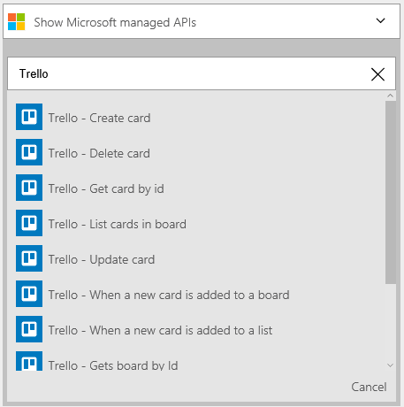
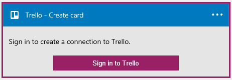
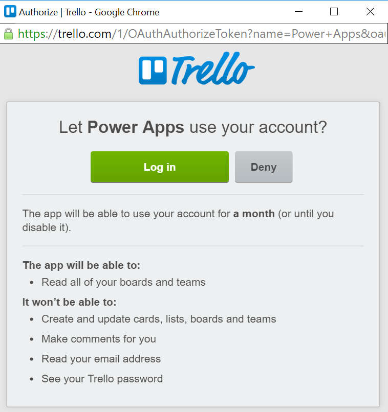
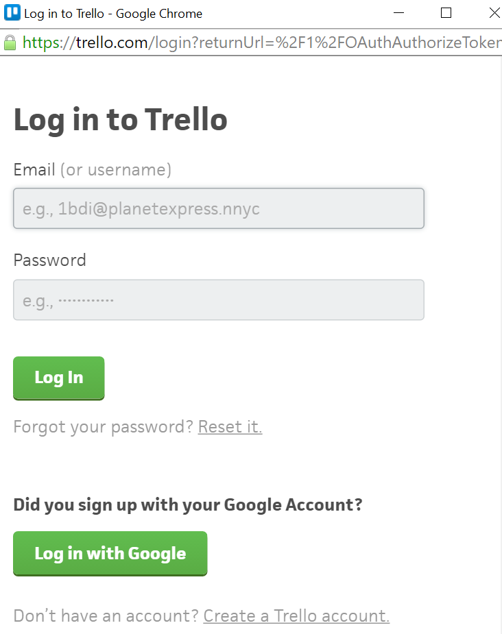
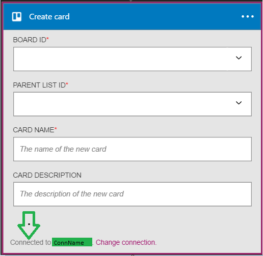

### Prerequisites
- A [Trello](http://trello.com) account 

Before you can use your Trello account in a Logic app, you must authorize the Logic app to connect to your Trello account. Fortunately, you can do this easily from within your Logic app on the Azure Portal. 

Here are the steps to authorize your Logic app to connect to your Trello account:

1. To create a connection to Trello, in the Logic app designer, select **Show Microsoft managed APIs** in the drop down list then enter *Trello* in the search box. Select the trigger or action you'll like to use:  
  
2. If you haven't created any connections to Trello before, you'll get prompted to provide your Trello credentials. These credentials will be used to authorize your Logic app to connect to, and access your Trello account's data:  
   
3. Allow us to connect to Trello:  
     
4. Provide your Trello user name and password to authorize your Logic app:  
    
5. Notice the connection has been created and you are now free to proceed with the other steps in your Logic app:  
  
