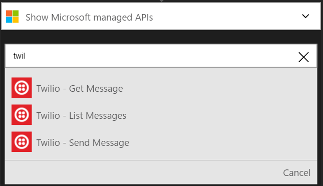
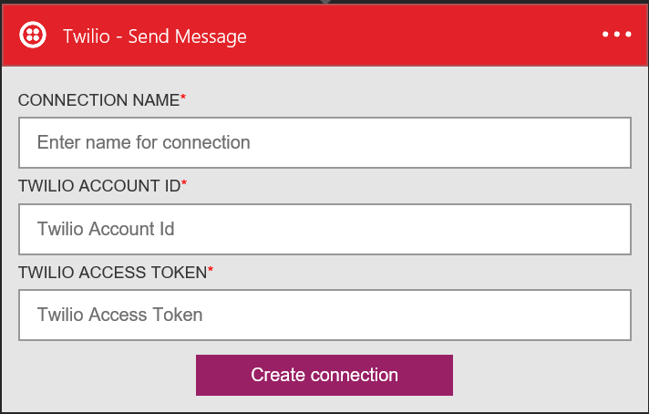
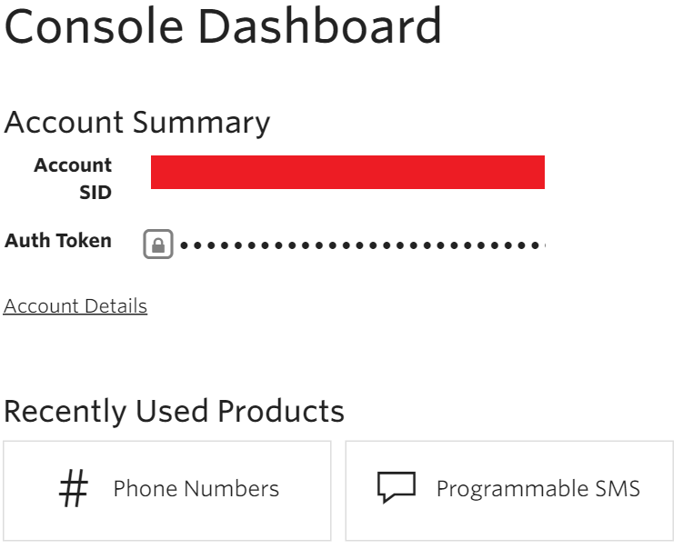
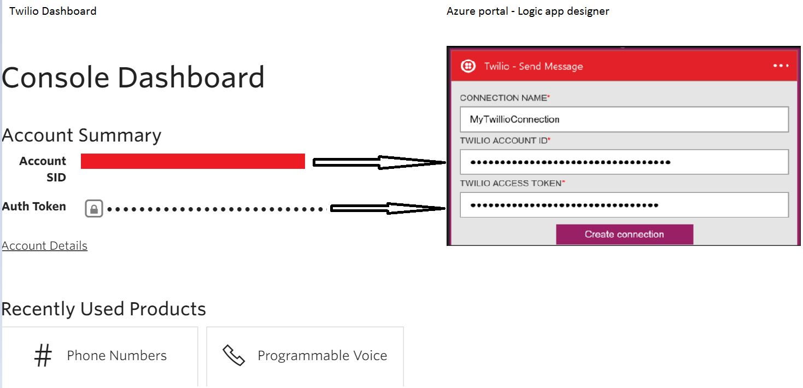
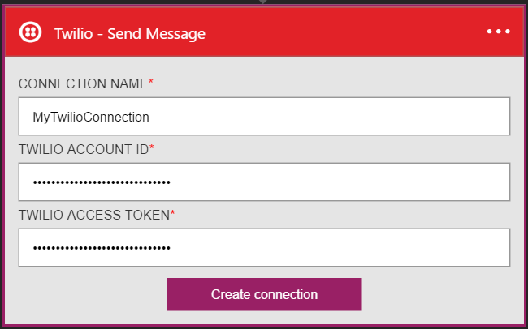
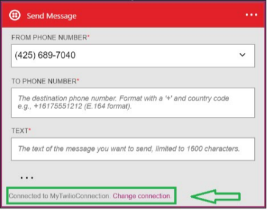

### Prerequisites
- A Twilio account
- A verified Twilio phone number that can receive SMS
- A verified Twilio phone number that can send SMS

>[AZURE.NOTE] If you are using a Twilio trial account, you can only send SMS to **verified** phone numbers.  

Before you can use your Twilio account in a Logic app, you must authorize the Logic app to connect to your Twilio account. Fortunately, you can do this easily from within your Logic app on the Azure Portal. 

Here are the steps to authorize your Logic app to connect to your Twilio account:

1. To create a connection to Twilio, in the Logic app designer, select **Show Microsoft managed APIs** in the drop down list then enter *Twilio* in the search box. Select the trigger or action you'll like to use:  
  
2. If you haven't created any connections to Twilio before, you'll get prompted to provide your Twilio credentials. These credentials will be used to authorize your Logic app to connect to, and access your Twilio account's data:  
    
3. You'll need the **Twilio account id** and **Twilio access token**  from the dashboard in Twilio, so log in to your Twilio account now to grab these two pieces of information:  
    
4. Twilio and Logic apps use different names to identify these two pieces of infomation. Here is how you must map them to the Logic apps dialog: 
    
5. Select the **Create connection** button:  
  
6. Notice the connection has been created and you are now free to proceed with the other steps in your Logic app:  
  