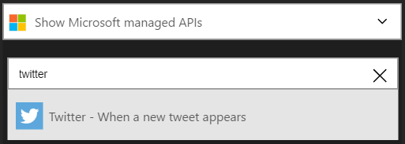
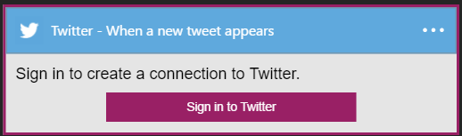
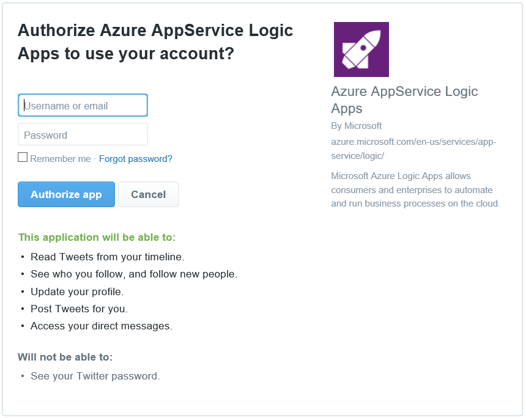
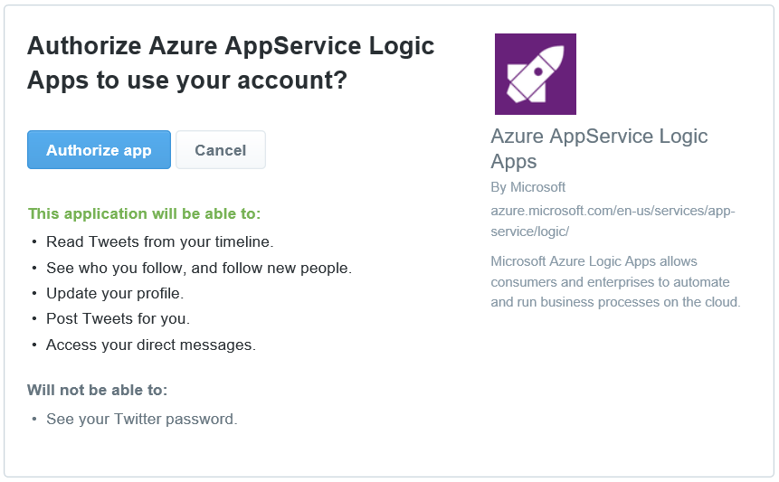
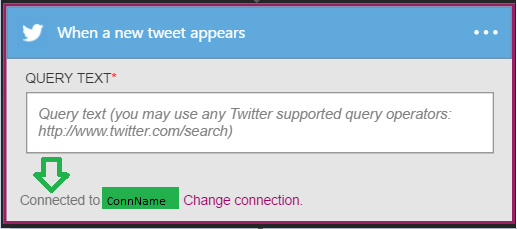

### Prerequisites
- A Twitter account 

Before you can use your Twitter account in a Logic app, you must authorize the Logic app to connect to your Twitter account. Fortunately, you can do this easily from within your Logic app on the Azure Portal. 

Here are the steps to authorize your Logic app to connect to your Twitter account:

1. To create a connection to Twitter, in the Logic app designer, select **Show Microsoft managed APIs** in the drop down list then enter *Twitter* in the search box. Select the trigger or action you'll like to use:  
  
2. If you haven't created any connections to Twitter before, you'll get prompted to provide your Twitter credentials. These credentials will be used to authorize your Logic app to connect to, and access your Twitter account's data:  
    
3. Provide your Twitter user name and password to authorize your Logic app:  
    
4. Confirm your authorization:  
    
6. Notice the connection has been created and you are now free to proceed with the other steps in your Logic app:  
  