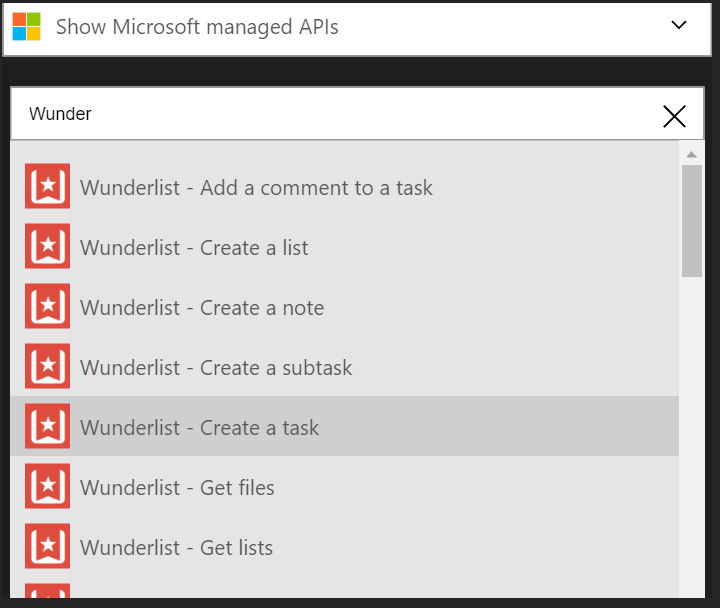
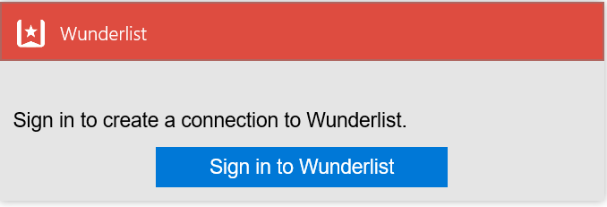
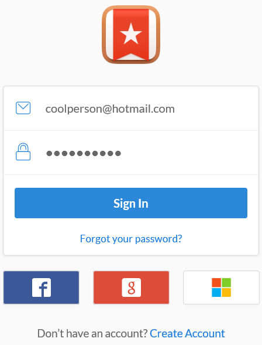
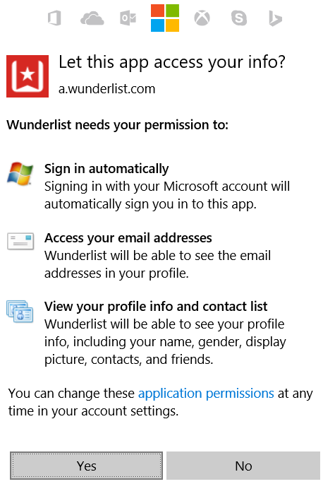

### Prerequisites
- A Wunderlist account  

Before you can use your Wunderlist account in a Logic app, you must authorize the Logic app to connect to your Wunderlist account. Fortunately, you can do this easily from within your Logic app on the Azure Portal. 

Here are the steps to authorize your Logic app to connect to your Wunderlist account:

1. To create a connection to Wunderlist, in the Logic app designer, select **Show Microsoft managed APIs** in the drop down list then enter *Wunderlist* in the search box. Select the trigger or action you'll like to use:  
  
2. If you haven't created any connections to Wunderlist before, you'll get prompted to provide your Wunderlist credentials. These credentials will be used to authorize your Logic app to connect to, and access your Wunderlist account's data:   
    
2. Provide your credentials then select the button to sign in  
    
3. You'll then be told what the Logic app will have permissions to do with your Wunderlist account. If you agree, select the button to indicate your agreement. 
    
4. Finally, select the **Authorize** button  
    

