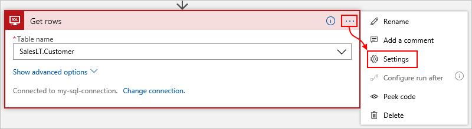
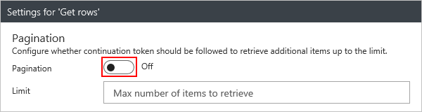

### Set up pagination

For some connectors and their actions that retrieve multiple items, 
your results might exceed the connector's default page size. 
In this case, the action returns only the first page of results. 
For example, the default page size for the **SQL Server - Get rows** action is 2048, 
but might differ based on other settings. To make sure you get all the records, 
turn on the **Pagination** setting for that action. This setting has your logic app 
ask the connector for the remaining records, but return all the results as a 
single message when the action finishes. 

Here are just some connectors where you can 
turn on pagination for specific actions: 

* <a href="https://docs.microsoft.com/connectors/db2/" target="_blank">DB2</a>
* <a href="https://docs.microsoft.com/connectors/dynamicscrmonline/" target="_blank">Dynamics 365 CRM Online</a>
* <a href="https://docs.microsoft.com/connectors/excel/" target="_blank">Excel</a>
* <a href="https://docs.microsoft.com/connectors/oracle/" target="_blank">Oracle Database</a>
* <a href="https://docs.microsoft.com/connectors/sharepointonline/" target="_blank">SharePoint</a>
* <a href="https://docs.microsoft.com/connectors/sql/" target="_blank">SQL Server</a> 

Here is an example for the **Get rows** action:

1. To find whether the action supports pagination, 
open the action's **Settings**. 

   

2. If the action supports pagination, 
change the **Pagination** setting from **Off** to **On**. 
To make sure that the action returns a minimum set of results, 
specify a value for **Limit**.

   

3. When you're ready, choose **Done**.