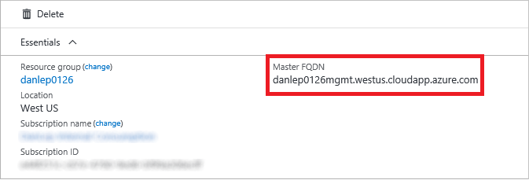
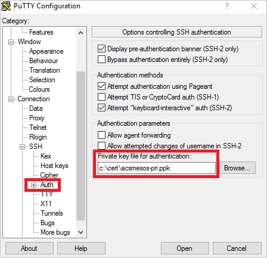
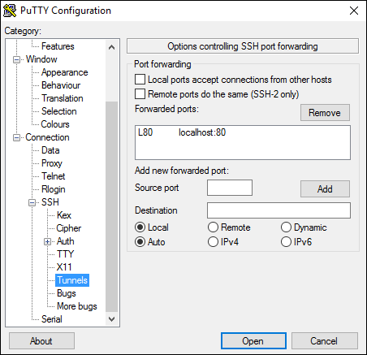
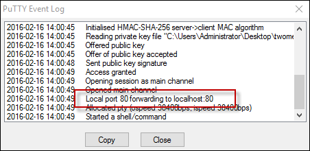

# Make a remote connection to a Kubernetes, DC/OS, or Docker Swarm cluster
After creating an Azure Container Service cluster, you need to connect to the cluster to deploy and manage workloads. This article describes how to connect to the master VM of the cluster from a remote computer. 

The Kubernetes, DC/OS, and Docker Swarm clusters provide HTTP endpoints locally. For Kubernetes,
this endpoint is securely exposed on the internet, and you can access it by running the `kubectl` command-line tool from any internet-connected machine. 

For DC/OS 
and Docker Swarm, we recommend that you create a secure shell (SSH) tunnel from your local computer to the cluster management system. After the tunnel is established, you can run commands which use the HTTP endpoints and view the orchestrator's web interface (if available) from your local system. 

## Prerequisites

* A Kubernetes, DC/OS, or Docker Swarm cluster [deployed in Azure Container Service](../articles/container-service/dcos-swarm/container-service-deployment.md).
* SSH RSA private key file, corresponding to the public key added to the cluster during deployment. These commands assume that the private SSH key is in `$HOME/.ssh/id_rsa` on your computer. See these 
instructions for [macOS and Linux](../articles/virtual-machines/linux/mac-create-ssh-keys.md)
or [Windows](../articles/virtual-machines/linux/ssh-from-windows.md)
for more information. If the SSH connection isn't working, you may need to 
[reset your SSH keys](../articles/virtual-machines/linux/troubleshoot-ssh-connection.md).

## Connect to a Kubernetes cluster

Follow these steps to install and configure `kubectl` on your computer.

> [!NOTE] 
> On Linux or macOS, you might need to run the commands in this section using `sudo`.
> 

### Install kubectl
One way to install this
tool is to use the `az acs kubernetes install-cli` Azure CLI command. To run this command, make sure that you [installed](/cli/azure/install-az-cli2) the latest version of the Azure CLI and are signed in to an Azure account (`az login`).

```azurecli
# Linux or macOS
az acs kubernetes install-cli [--install-location=/some/directory/kubectl]

# Windows
az acs kubernetes install-cli [--install-location=C:\some\directory\kubectl.exe]
```

Alternatively, you can download the latest `kubectl` client directly from the [Kubernetes releases page](https://github.com/kubernetes/kubernetes/blob/master/CHANGELOG.md). For more information, see [Installing and Setting up kubectl](https://kubernetes.io/docs/tasks/kubectl/install/).

### Download cluster credentials
Once you have `kubectl` installed, you need to copy the cluster credentials to your machine. One way to do
get the credentials is with the `az acs kubernetes get-credentials` command. Pass the name of the resource group and the name of the container service resource:

```azurecli
az acs kubernetes get-credentials --resource-group=<cluster-resource-group> --name=<cluster-name>
```

This command downloads the cluster credentials to `$HOME/.kube/config`, where `kubectl` expects it to be located.

Alternatively, you can use `scp` to securely copy the file from `$HOME/.kube/config` on the master VM to your local machine. For example:

```bash
mkdir $HOME/.kube
scp azureuser@<master-dns-name>:.kube/config $HOME/.kube/config
```

If you are on Windows, you can use Bash on Ubuntu on Windows, the PuTTy secure file copy client, or a similar tool.

### Use kubectl

Once you have `kubectl` configured, test the connection by listing the nodes in your cluster:

```bash
kubectl get nodes
```

You can try other `kubectl` commands. For example, you can view the Kubernetes Dashboard. First, run a proxy to the Kubernetes API server:

```bash
kubectl proxy
```

The Kubernetes UI is now available at: `http://localhost:8001/ui`.

For more information, see the [Kubernetes quick start](http://kubernetes.io/docs/user-guide/quick-start/).

## Connect to a DC/OS or Swarm cluster

To use the DC/OS and Docker Swarm clusters deployed by Azure Container Service, follow these instructions to create a SSH tunnel from your local Linux, macOS, or Windows system. 

> [!NOTE]
> These instructions focus on tunneling TCP traffic over SSH. You can also start an interactive SSH session with one of the internal cluster management systems, but we don't recommend this. Working directly on an internal system risks inadvertent configuration changes.  
> 

### Create an SSH tunnel on Linux or macOS
The first thing that you do when you create an SSH tunnel on Linux or macOS is to locate the public DNS name of the load-balanced masters. Follow these steps:


1. In the [Azure portal](https://portal.azure.com), browse to the resource group containing your container service cluster. Expand the resource group so that each resource is displayed. 

2. Click the **Container service** resource, and click **Overview**. The **Master FQDN** of the cluster appears under **Essentials**. Save this name for later use. 

    

    Alternatively, run the `az acs show` command on your container service. Look for the **Master Profile:fqdn** property in the command output.

3. Now open a shell and run the `ssh` command by specifying the following values: 

    **LOCAL_PORT** is the TCP port on the service side of the tunnel to connect to. For Swarm, set this to 2375. For DC/OS, set this to 80. 
    **REMOTE_PORT** is the port of the endpoint that you want to expose. For Swarm, use port 2375. For DC/OS, use port 80.  
    **USERNAME** is the user name that was provided when you deployed the cluster.  
    **DNSPREFIX** is the DNS prefix that you provided when you deployed the cluster.  
    **REGION** is the region in which your resource group is located.  
    **PATH_TO_PRIVATE_KEY** [OPTIONAL] is the path to the private key that corresponds to the public key you provided when you created the cluster. Use this option with the `-i` flag.

    ```bash
    ssh -fNL LOCAL_PORT:localhost:REMOTE_PORT -p 2200 [USERNAME]@[DNSPREFIX]mgmt.[REGION].cloudapp.azure.com
    ```
  
  > [!NOTE]
  > The SSH connection port is 2200 and not the standard port 22. In a cluster with more than one master VM, this is the connection port to the first master VM.
  > 

  The command returns without output.

See the examples for DC/OS and Swarm in the following sections.    

### DC/OS tunnel
To open a tunnel for DC/OS endpoints, run a command like the following:

```bash
sudo ssh -fNL 80:localhost:80 -p 2200 azureuser@acsexamplemgmt.japaneast.cloudapp.azure.com 
```

> [!NOTE]
> Ensure that you do not have another local process that binds port 80. If necessary, you can specify a local port other than port 80, such as port 8080. However, some web UI links might not work when you use this port.
>

You can now access the DC/OS endpoints from your local system through the following URLs (assuming local port 80):

* DC/OS: `http://localhost:80/`
* Marathon: `http://localhost:80/marathon`
* Mesos: `http://localhost:80/mesos`

Similarly, you can reach the rest APIs for each application through this tunnel.

### Swarm tunnel
To open a tunnel to the Swarm endpoint, run a command like the following:

```bash
ssh -fNL 2375:localhost:2375 -p 2200 azureuser@acsexamplemgmt.japaneast.cloudapp.azure.com
```
> [!NOTE]
> Ensure that you do not have another local process that binds port 2375. For example, if you are running the Docker daemon locally, it's set by default to use port 2375. If necessary, you can specify a local port other than port 2375.
>

Now you can access the Docker Swarm cluster using the Docker command-line interface (Docker CLI) on your local system. For installation instructions, see [Install Docker](https://docs.docker.com/engine/installation/).

Set your DOCKER_HOST environment variable to the local port you configured for the tunnel. 

```bash
export DOCKER_HOST=:2375
```

Run Docker commands that tunnel to the Docker Swarm cluster. For example:

```bash
docker info
```

### Create an SSH tunnel on Windows
There are multiple options for creating SSH tunnels on Windows. If you are running Bash on Ubuntu on Windows or a similar tool, you can follow the SSH tunneling instructions shown earlier in this article for macOS and Linux. As an alternative on Windows, this section describes how to use PuTTY to create the tunnel.

1. [Download PuTTY](http://www.chiark.greenend.org.uk/~sgtatham/putty/download.html) to your Windows system.

2. Run the application.

3. Enter a host name that is comprised of the cluster admin user name and the public DNS name of the first master in the cluster. The **Host Name** looks similar to `azureuser@PublicDNSName`. Enter 2200 for the **Port**.

    

4. Select **SSH > Auth**. Add a path to your private key file (.ppk format) for authentication. You can use a tool such as [PuTTYgen](http://www.chiark.greenend.org.uk/~sgtatham/putty/download.html) to generate this file from the SSH key used to create the cluster.

    

5. Select **SSH > Tunnels** and configure the following forwarded ports:

    * **Source Port:** Use 80 for DC/OS or 2375 for Swarm.
    * **Destination:** Use localhost:80 for DC/OS or localhost:2375 for Swarm.

    The following example is configured for DC/OS, but will look similar for Docker Swarm.

    > [!NOTE]
    > Port 80 must not be in use when you create this tunnel.
    > 

    

6. When you're finished, click **Session > Save** to save the connection configuration.

7. To connect to the PuTTY session, click **Open**. When you connect, you can see the port configuration in the PuTTY event log.

    

After you've configured the tunnel for DC/OS, you can access the related endpoints at:

* DC/OS: `http://localhost/`
* Marathon: `http://localhost/marathon`
* Mesos: `http://localhost/mesos`

After you've configured the tunnel for Docker Swarm, open your Windows settings to configure a system environment variable named `DOCKER_HOST` with a value of `:2375`. Then, you can access the Swarm cluster through the Docker CLI.

## Next steps
Deploy and manage containers in your cluster:

* [Work with Azure Container Service and Kubernetes](../articles/container-service/kubernetes/container-service-kubernetes-ui.md)
* [Work with Azure Container Service and DC/OS](../articles/container-service//dcos-swarm/container-service-mesos-marathon-rest.md)
* [Work with the Azure Container Service and Docker Swarm](../articles//container-service/dcos-swarm/container-service-docker-swarm.md)

