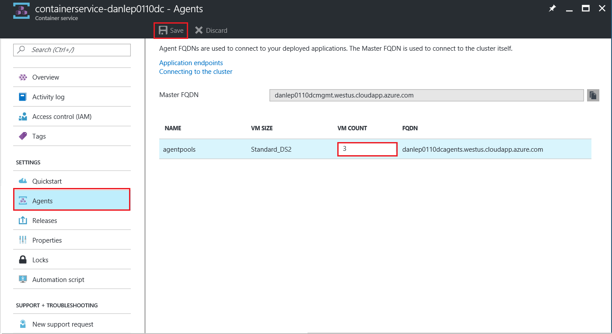

[!INCLUDE [ACS deprecation](container-service-deprecation.md)]

After [deploying an Azure Container Service cluster](../articles/container-service/dcos-swarm/container-service-deployment.md), you might need to change the number of agent nodes. For example, you might need more agents so you can run more container applications or instances. 

You can change the number of agent nodes in a DC/OS, Docker Swarm, or Kubernetes cluster by using the Azure portal or the Azure CLI. 

## Scale with the Azure portal

1. In the [Azure portal](https://portal.azure.com), browse for **Container services**, and then click the container service that you want to modify.
2. In the **Container service** blade, click **Agents**.
3. In **VM Count**, enter the desired number of agents nodes.

    

4. To save the configuration, click **Save**.

## Scale with the Azure CLI

[Install the Azure CLI](/cli/azure/install-azure-cli) and sign in to an Azure account with `az login`.

### See the current agent count
To see the number of agents currently in the cluster, run the `az acs show` command. This shows the cluster configuration. For example, the following command shows the configuration of the container service named `containerservice-myACSName` in the resource group `myResourceGroup`:

```azurecli
az acs show -g myResourceGroup -n containerservice-myACSName
```

The command returns the number of agents in the `Count` value under `AgentPoolProfiles`.

### Use the az acs scale command
To change the number of agent nodes, run the `az acs scale` command and supply the **resource group**, **container service name**, and the desired **new agent count**. By using a smaller or higher number, you can scale down or up, respectively.

For example, to change the number of agents in the previous cluster to 10, type the following command:

```azurecli
az acs scale -g myResourceGroup -n containerservice-myACSName --new-agent-count 10
```

The Azure CLI returns a JSON string representing the new configuration of the container service, including the new agent count.

For more command options, run `az acs scale --help`.

## Scaling considerations

* The number of agent nodes must be between 1 and 100, inclusive. 

* Your cores quota can limit the number of agent nodes in a cluster.

* Agent node scaling operations are applied to an Azure virtual machine scale set that contains the agent pool. In a DC/OS cluster, only agent nodes in the private pool are scaled by the operations shown in this article.

* Depending on the orchestrator you deploy in your cluster, you can separately scale the number of instances of a container running on the cluster. For example, in a DC/OS cluster, use the [Marathon UI](../articles/container-service/dcos-swarm/container-service-mesos-marathon-ui.md) to change the number of instances of a container application.


## Next steps
* See [more examples](../articles/container-service/dcos-swarm/container-service-create-acs-cluster-cli.md) of using Azure CLI commands with Azure Container Service.
* Learn more about [DC/OS agent pools](../articles/container-service/dcos-swarm/container-service-dcos-agents.md) in Azure Container Service.

