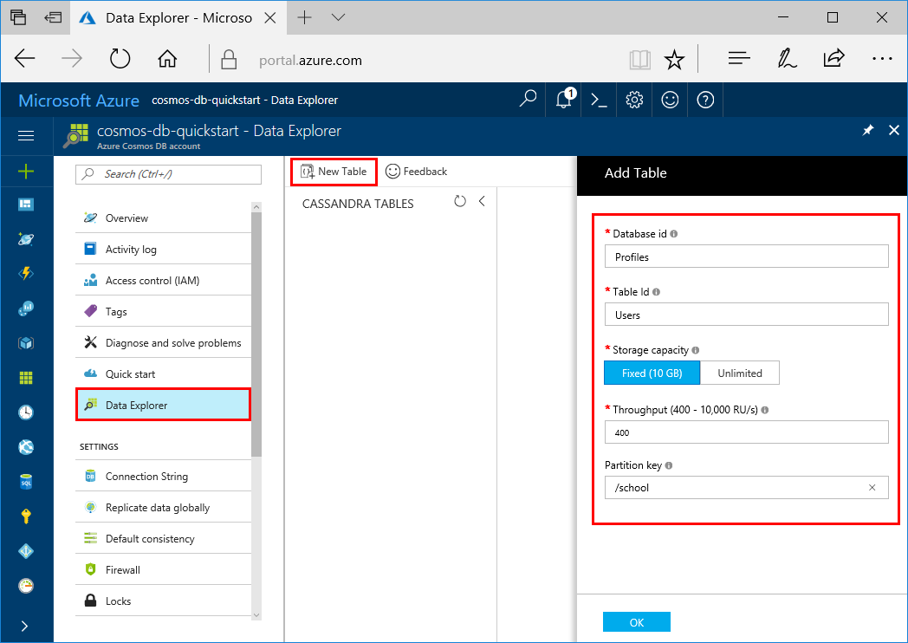

You can now use the Data Explorer tool in the Azure portal to create a Cassandra table. 

1. In the Azure portal, in the menu on the left, select **Data Explorer**.

2. Under **Data Explorer**, select **New Table**. Then fill in the page by using the following information:

    

    Setting|Suggested value|Description
    ---|---|---
    Database id|sample-database|The ID for your new database. Database names must be between 1 and 255 characters and can't contain `/ \ # ?` or a trailing space.
    Table id|sample-graph|The ID for your new graph. Graph names have the same character requirements as database IDs.
    Storage capacity| Fixed (10 GB)|Change the value to **Fixed (10 GB)**. This value is the storage capacity of the database.
    Throughput|400 RUs|Change the throughput to 400 request units per second (RU/s). If you want to reduce latency, you can scale up the throughput later.
    Partition key|/firstName|A partition key that distributes data evenly to each partition. Selecting the correct partition key is important in creating a performant graph. For more information, see [Designing for partitioning](../articles/cosmos-db/partition-data.md#designing-for-partitioning).

3. After the form is filled out, select **OK**.
