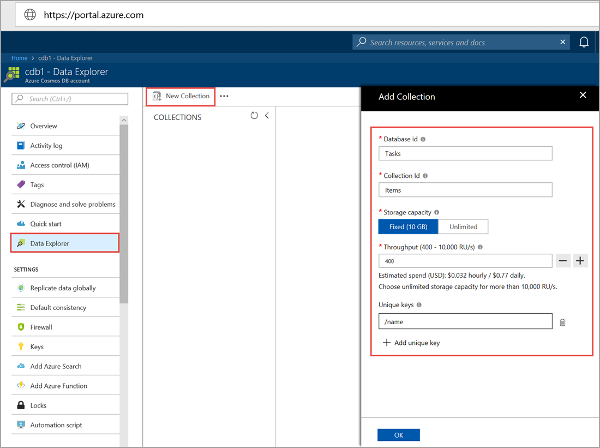

You can now use the Data Explorer tool in the Azure portal to create a database and container. 

1. Select **Data Explorer** > **New Container**. 
    
    The **Add Container** area is displayed on the far right, you may need to scroll right to see it.

    

2. In the **Add container** page, enter the settings for the new container.

    |Setting|Suggested value|Description
    |---|---|---|
    |**Database ID**|Tasks|Enter *Tasks* as the name for the new database. Database names must contain from 1 through 255 characters, and they cannot contain `/, \\, #, ?`, or a trailing space. Check the **Provision database throughput** option, it allows you to share the throughput provisioned to the database across all the containers within the database. This option also helps with cost savings. |
    |**Throughput**|400|Leave the throughput at 400 request units per second (RU/s). If you want to reduce latency, you can scale up the throughput later.| 
    |**Container ID**|Items|Enter *Items* as the name for your new container. Container IDs have the same character requirements as database names.|
    |**Partition key**| /category| The sample described in this article uses */category* as the partition key.|
    
    In addition to the preceding settings, you can optionally add **Unique keys** for the container. Let's leave the field empty in this example. Unique keys provide developers with the ability to add a layer of data integrity to the database. By creating a unique key policy while creating a container, you ensure the uniqueness of one or more values per partition key. To learn more, refer to the [Unique keys in Azure Cosmos DB](../articles/cosmos-db/unique-keys.md) article.
    
    Select **OK**. The Data Explorer displays the new database and container.