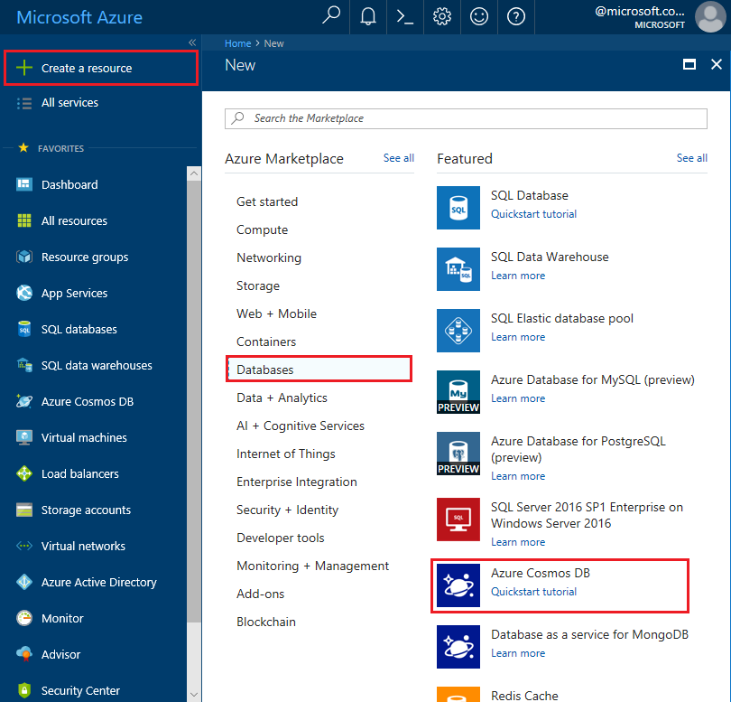
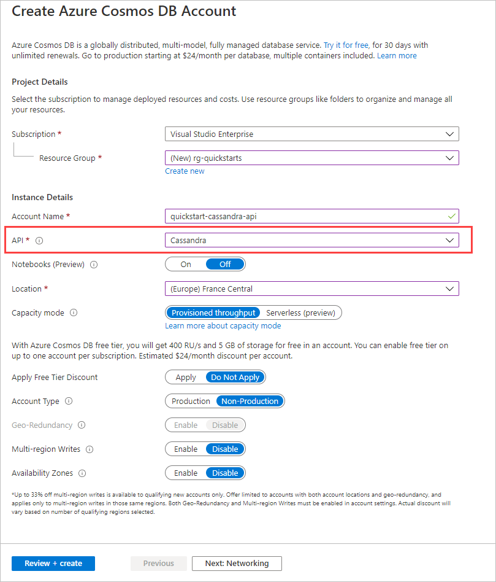

1. In a new browser window, sign in to the [Azure portal](https://portal.azure.com/).

2. Select **Create a resource** > **Databases** > **Azure Cosmos DB**.
   
   

3. In the **Create Azure Cosmos DB Account** page, enter the settings for the new Azure Cosmos DB account. 
 
    Setting|Value|Description
    ---|---|---
    Subscription|Your subscription|Select the Azure subscription that you want to use for this Azure Cosmos DB account. 
    Resource Group|Create new  Then enter the same unique name as provided in ID|Select **Create new**. Then enter a new resource-group name for your account. For simplicity, use the same name as your ID. 
    Account Name|Enter a unique name|Enter a unique name to identify your Azure Cosmos DB account. Because *documents.azure.com* is appended to the ID that you provide to create your URI, use a unique ID.  The ID can use only lowercase letters, numbers, and the hyphen (-) character. It must be between 3 and 31 characters in length.
    API|Cassandra|The API determines the type of account to create. Azure Cosmos DB provides five APIs: Core(SQL) for document databases, Gremlin for graph databases, MongoDB for document databases, Azure Table, and Cassandra. Currently, you must create a separate account for each API.   Select **Cassandra**  because in this quickstart you are creating a table that works with the Cassandra API.   [Learn more about the Cassandra API](../articles/cosmos-db/cassandra-introduction.md).|
    Location|Select the region closest to your users|Select a geographic location to host your Azure Cosmos DB account. Use the location that's closest to your users to give them the fastest access to the data.

    Select **Review+Create**. You can skip the **Network** and **Tags** section. 

    

4. The account creation takes a few minutes. Wait for the portal to display the page saying **Congratulations! Your Azure Cosmos DB account was created**.

