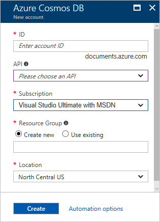

1. In a new window, sign in to the [Azure portal](https://portal.azure.com/).
2. In the left pane, click **New**, click **Databases**, and then click **Azure Cosmos DB**.
   
   

3. In the **New account** blade, specify the desired configuration for the Azure Cosmos DB account. 

    With Azure Cosmos DB, you can choose one of four programming models: Gremlin (graph), MongoDB, SQL (DocumentDB), and Table (key-value).  
       
    In this quick-start article, we program against the Graph API, so choose **Gremlin (graph)** as you fill out the form. If you have document data from a catalog app, key/value (table) data, or data that's migrated from a MongoDB app, realize that Azure Cosmos DB can provide a highly available, globally distributed database service platform for all your mission-critical applications.

    On the **New account** blade, complete the fields with the information in the following screenshot as a guide only. Because your own values will not match those in the screenshot, be sure to choose unique values as you set up your account. 
 
    

    Setting|Suggested value|Description
    ---|---|---
    ID|*Unique value*|A unique name that you choose to identify the Azure Cosmos DB account. Because *documents.azure.com* is appended to the ID that you provide to create your URI, use a unique but identifiable ID. The ID must contain only lowercase letters, numbers, and the hyphen (-) character, and it must contain from 3 to 50 characters.
    API|Gremlin (graph)|We program against the [Graph API](../articles/cosmos-db/graph-introduction.md) later in this article.|
    Subscription|*Your subscription*|The Azure subscription that you want to use for the Azure Cosmos DB account. 
    Resource Group|*The same value as ID*|The new resource group name for your account. For simplicity, you can use the same name as your ID. 
    Location|*The region closest to your users*|The geographic location in which to host your Azure Cosmos DB account. Choose the location closest to your users to give them the fastest access to the data.

4. Click **Create** to create the account.
5. On the toolbar, click **Notifications** to monitor the deployment process.

    

6.  When the deployment is complete, open the new account from the **All Resources** tile. 

    